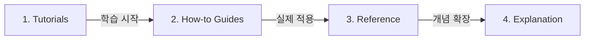

# OKF Documentation Hub (`docs/okf/`)

본 디렉토리는 OKF (Open Knowledge Framework) 최신 버전 표준에 따라 관리되는 기술 명세 및 문서 허브입니다.

---

## 🧭 Diátaxis 문서화 프레임워크 가이드

Diátaxis(디아탁시스)는 문서 작성을 **사용자의 목적**과 **작업의 성격**에 따라 4가지 영역으로 나눈 문서화 프레임워크입니다. "사용자가 지금 뭘 하려고 하는가?"를 기준으로 글의 성격을 명확히 분리하는 것이 핵심입니다.

### 📊 Diátaxis 4가지 구조 매트릭스

Diátaxis는 **실습 vs 이론(행동 vs 지식)** 축과 **학습 vs 작업(목적)** 축으로 나누어 설명할 수 있습니다.

| 구분 | 학습 중심 (Learning) | 작업/목적 중심 (Task/Goal) |
| --- | --- | --- |
| **실습/행동 (Practical)** | **1. Tutorials (튜토리얼)** - 대상: 초보자/입문자 - 비유: 요리 교실 (선생님 가이드) | **2. How-to Guides (가이드)** - 대상: 실제 작업을 수행하는 사람 - 비유: 요리 레시피 |
| **이론/지식 (Theoretical)** | **4. Explanation (설명/개념)** - 대상: 원리를 이해하려는 사람 - 비유: 음식의 역사와 오마카세 철학 | **3. Reference (참고자료)** - 대상: 사양/정보를 찾는 사람 - 비유: 식재료 영양성분표 및 사양서 |

---

### 💡 4가지 문서의 핵심 차이점

#### 1. Tutorials (튜토리얼) = "따라하며 배우기"
- **목적**: 사용자가 처음 시작할 때 손맛을 익히도록 돕는 과정.
- **핵심**: 성공적인 결과보다 **학습 경험** 자체가 중요합니다.
- **예시**: "10분 만에 첫 AI Agent Skill 작성해보기"

#### 2. How-to Guides (하우투 가이드) = "특정 문제 해결하기"
- **목적**: 사용자가 구체적인 목표나 문제를 해결하도록 안내.
- **핵심**: 쓸데없는 설명은 빼고 **해결 순서(절차)**에 집중합니다.
- **예시**: "새로운 MCP 서드파티 스킬을 기존 플러그인에 등록하는 방법"

#### 3. Reference (참고자료) = "사양서 및 데이터"
- **목적**: 정보, 사양, API 명세 등을 건조하고 정확하게 전달.
- **핵심**: 주관적 설명 없이 **명확하고 기술적인 사실**만 기록합니다.
- **예시**: OKF 명세 문서 목록, API 파라미터 및 설정 스키마

#### 4. Explanation (설명/개념) = "원리 이해하기"
- **목적**: 배경지식, 아키텍처, 설계 이유를 설명하여 깊은 이해를 지원.
- **핵심**: "어떻게 만드는가"가 아니라 **"왜 이렇게 설계했는가"**를 다룹니다.
- **예시**: "Antigravity 및 Codex Agent 런타임의 동기화 및 격리 구조"

---

### 🔄 문서 흐름 연결 (Documentation Flow)

1. **Tutorials (학습)**: 먼저 전체적인 감을 잡고,
2. **How-to Guides (목적)**: 실무에서 필요한 개별 과제를 해결하다가,
3. **Reference (정보)**: 필요한 API나 설정 매개변수를 찾아보고,
4. **Explanation (이해)**: 시스템이 내부적으로 왜 그렇게 동작하는지 아키텍처를 이해하는 단계로 확장됩니다.

---

### 📑 OKF 명세 문서 Index

OKF 가이드라인에 따른 `docs/okf/` 내부 서브 폴더별 문서 목록입니다:

#### 🎓 1. Tutorials (`docs/okf/tutorials/`)
- *(입문자용 실습 튜토리얼 문서 추가 시 등록)*

#### 🛠️ 2. How-to Guides (`docs/okf/how-to/`)
- *(특정 과제 해결을 위한 하우투 가이드 문서 추가 시 등록)*

#### 📋 3. Reference (`docs/okf/reference/`)
- *(기술 명세 및 API/설정 참고 문서 추가 시 등록)*

#### 💡 4. Explanation (`docs/okf/explanation/`)
- *(아키텍처 및 개념 설명 문서 추가 시 등록)*
