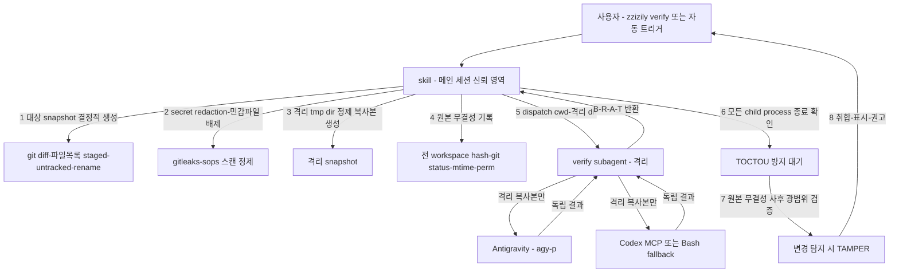
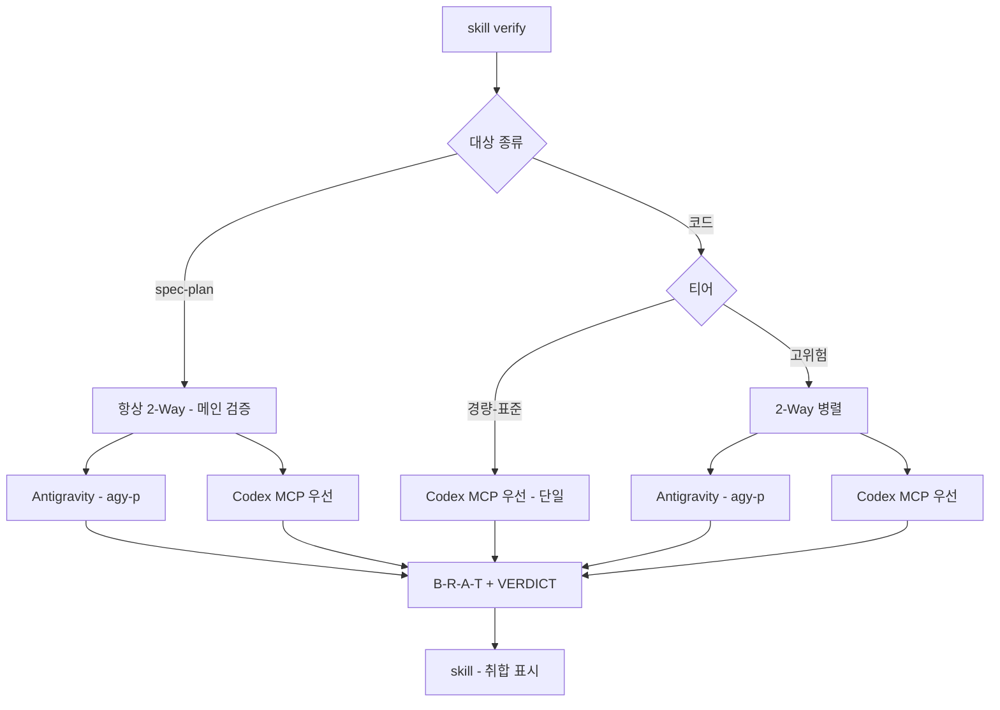

# zzizily 검증 컴포넌트 설계 (skill + subagent 하이브리드)

> **Date**: 2026-07-15
> **Status**: Draft v3 (2-Way dogfood 2라운드 반영 — 보안 책임 skill 이관, 격리 snapshot, truth table 보강)
> **Topic**: 05-multi-agent.md 검증 체계를 zzizily 플러그인의 독립 컴포넌트로 이관

## 목차

- [개요](#개요)
- [배경 및 동기](#배경-및-동기)
- [아키텍처 (v3)](#아키텍처-v3)
- [보안 책임 분리 (v3 핵심)](#보안-책임-분리-v3-핵심)
- [dispatch 실행 계약](#dispatch-실행-계약)
- [데이터 흐름](#데이터-흐름)
- [subagent 상세 구성](#subagent-상세-구성)
- [Codex Fallback (Plan B)](#codex-fallback-plan-b)
- [병렬 orchestration](#병렬-orchestration)
- [라우팅 매핑](#라우팅-매핑)
- [fail-closed 판정](#fail-closed-판정)
- [rules 이관 처리](#rules-이관-처리)
- [파일 구조 및 plugin.json](#파일-구조-및-pluginjson)
- [OMC 차별화](#omc-차별화)
- [성공 기준](#성공-기준)
- [범위 외 (YAGNI)](#범위-외-yagni)

## 개요

`~/.claude/rules/05-multi-agent.md`의 검증 체계(3단계 티어, Codex+Antigravity 2-Way, B/R/A/T 포맷)를 zzizily 플러그인의 독립 컴포넌트로 이관.

**하이브리드**: skill(`/zzizily:verify`)이 진입점·판사·**보안 책임**(무결성·secret), subagent(`verify`)가 격리 snapshot에서 순수 2-Way 검증.

검증 대상:
1. superpowers spec/plan (문서) — **메인 검증, 항상 2-Way**
2. AI agent 생산물 (코드, PR diff) — 티어 기반

## 배경 및 동기

### rules → 독립 컴포넌트 이관

기존 검증 체계는 `~/.claude/rules/05-multi-agent.md` 전역 지침. 사용자는 이 검증 로직을 **독립 plugin 컴포넌트로 분리**하길 원함. 자동 트리거를 위해 rules에는 **최소 트리거 규칙 + 인프라 포인터**만 잔류.

### skill vs subagent 결정

| 기준 | Skill | Subagent | 선택 |
| :--- | :--- | :--- | :--- |
| 격리 / 자기편향 방지 | ✗ 메인 세션 = 작성자 | ✓ 독립 컨텍스트 | **subagent(검증 실행)** |
| 사용자 능동 호출 + 보안 책임 | ✓ 메인 세션 신뢰 영역 | △ | **skill(진입점+보안)** |

하이브리드: skill(신뢰, 보안·판사) + subagent(격리, 순수 검증).

### OMC verifier/critic은 2-Way 자동화 안 함

OMC `verifier`/`critic`은 Claude 내장 도구로만 검증, Codex/Gemini 호출 안 함. **2-Way 교차검증 자동화는 빈 자리** — zzizily `verify` 유일 담당.

### spec/plan은 항상 2-Way (메인 검증)

티어 무관 항상 2-Way. 단일 패스 타협 안 함.

## 아키텍처 (v3)



### 컴포넌트 분담

| 컴포넌트 | 역할 | 위치 |
| :--- | :--- | :--- |
| **skill** `verify` | 진입점 + **보안 책임**(snapshot 생성·redaction·무결성 감시) + 판사(취합). `/zzizily:verify` + 자동 트리거 | `skills/verify/SKILL.md` |
| **subagent** `verify` | 격리 snapshot에서 **순수 2-Way 검증만**. 보안 처리 안 함(검증 대상 분리). B/R/A/T 반환 | `.claude-plugin/agents/verify.md` |

### 핵심 원칙

- **보안 책임 분리**: 무결성 검증·secret 처리는 신뢰 영역(skill)이 담당. subagent는 조종 가능성이 있으므로 보안 결정권 없음
- skill은 판사 + 보안관. subagent는 격리된 검사관
- 2-Way: 각 외부 에이전트 서로 결과 안 보고 독립 작업 → skill이 취합

## 보안 책임 분리 (v3 핵심)

dogfood 2라운드에서 양 에이전트(Antigravity/Codex)가 동일 지적: **subagent가 보안 검증(무결성·secret)을 자체 수행하면 검증 대상의 prompt injection에 조종되어 무력화**. v3는 보안 책임을 skill(신뢰)로 이관.

### skill 담당 (메인 세션, 신뢰)

| 단계 | 조치 |
| :--- | :--- |
| 대상 snapshot | `git diff`(staged/unstaged/untracked/rename/delete/binary/대용량/혼합) 결정적 생성. 대상 외·대상 내 우선순위 적용 |
| secret redaction | `gitleaks`/sops 패턴 스캔. 매칭 시 `[REDACTED]` 치환. **scanner 실패/미설치 시 fail-closed**(검증 중단). binary/base64/분할 secret/encrypted도 스캔 |
| 민감 파일 배제 | `.env*`, `.key`, `.sops`, `~/.codex/`, `~/.config/**` 등은 snapshot에서 원천 제외 |
| 격리 snapshot | **tmp directory**에 정제 복사본 생성. 이것만 subagent에 전달. **원본 workspace 접근 차단** |
| 무결성 기록(전) | 전 workspace 상태 기록: tracked/untracked 파일 hash, `git status`, mtime, permission. **대상뿐 아니라 대상 외·metadata까지** |
| 무결성 검증(후) | **모든 child process 종료 확인 후**(TOCTOU 방지) 동일 항목 재측정·비교. write→restore·대상 외 변경·untracked 생성·metadata/permission 변경 탐지. 변경 시 `Integrity: TAMPER-DETECTED`, 검증 무효(INCOMPLETE) |
| 외부 전송 동의 | **최초 1회**(project-level 사전 동의 또는 첫 호출 확인). 동의 없으면 외부 provider 전송 금지 → 수동 검증 안내 |

### subagent 담당 (격리, 순수 검증)

- `cwd = 격리 tmp directory`로 제한. 원본 workspace·Codex config·`.env` 접근 불가
- 격리 복사본만으로 2-Way 검증 (Codex/Antigravity에 복사본만 전달)
- 보안 결정(redaction·배제·무결성 판정) **불가** — 오직 B/R/A/T 검증 결과만 반환
- Codex `cwd`도 격리 dir + `sandbox: read-only`. Antigravity `agy -p`에 격리 복사본 경로만

### 공격 표면 차단

| 위협 | v3 대응 |
| :--- | :--- |
| prompt injection으로 subagent 조종 | subagent는 보안 결정권 없음. 격리 복사본만 보므로 원본·secret 접근 불가 |
| subagent가 원본 수정(자기 검증 무효화) | 원본은 skill이 무결성 감시. subagent는 격리 복사본만. 사후 광범위 검증으로 탐지 |
| Codex/Antigravity가 workspace에서 `.env` 직접 읽기 | `cwd` 격리 dir + read-only. 원본 배제 |
| timeout process 사후 쓰기 (TOCTOU) | 모든 child process 종료 확인 후 무결성 검증 |
| 자기 출력 '검증' 재호출 (무한 루프) | rules 트리거 제외 필터(아래) |

## dispatch 실행 계약

```text
도구: Agent (Claude Code 내장)
subagent name: verify (plugin agents 디렉토리 discovery. namespace: zzizily:verify)
skill이 Agent 호출 시 입력(자연어 지시에 포함):
  - isolated_cwd: 격리 tmp directory 절대경로 (subagent 작업 디렉토리)
  - target_kind: spec-plan | code
  - target_files: 격리 복사본 내 상대경로 목록
  - tier: light | standard | high (코드만. spec-plan은 무시)
  - acceptance_criteria: 선택
  - provider_config: Codex model/sandbox, Antigravity 모델 (skill이 rules/인프라에서 읽어 전달)
반환 (subagent 최종 메시지 = 계약 결과):
  - Verification Report (출력 포맷). provider별 provenance 포함
미발견 처리: verify subagent discovery 실패 시 skill은 에러 리포트(plugin 미설치/agents 필드 누락/reload-plugins 의심) 출력 후 종료
```

skill SKILL.md에 `Agent` 도구 호출 예시와 위 계약 명시.

## 데이터 흐름

1. 사용자 `/zzizily:verify [대상]` 또는 자동 트리거(rules 최소 규칙 + 제외 필터)
2. **skill**: 외부 전송 동의 확인(최초 1회). 미동의 시 수동 안내 종료
3. **skill**: 대상 snapshot 결정적 생성 (staged/unstaged/untracked/rename/delete/binary/대용량/혼합 우선순위)
4. **skill**: secret redaction + 민감 파일 배제 → 정제. scanner 실패 시 fail-closed
5. **skill**: 격리 tmp directory에 정제 복사본 생성
6. **skill**: 원본 무결성 기록 (전 workspace: tracked/untracked hash, git status, mtime, permission)
7. **skill**: `Agent` 도구로 verify subagent dispatch (격리 cwd + 복사본 + config)
8. **subagent**: 격리 복사본으로 2-Way 검증 (병렬 orchestration). B/R/A/T 반환
9. **skill**: 모든 child process 종료 확인 (TOCTOU 방지 대기)
10. **skill**: 원본 무결성 사후 광범위 검증. 변경 시 TAMPER-DETECTED → INCOMPLETE
11. **skill**: 결과 취합·표시. blocker 있으면 수정 권고. 격리 tmp dir 정리

## subagent 상세 구성

### frontmatter

```yaml
---
name: verify
description: 격리 snapshot에서 Codex+Antigravity 2-Way 교차검증. 보안 결정권 없음, 순수 검증 후 B/R/A/T 반환.
model: opus          # 검증 품질 우선
level: 3
disallowedTools: Write, Edit   # 편집 금지. 보안 결정(redaction/배제/무결성)도 금지 — skill 전담
---
```

> subagent는 **보안 결정권 없음**. redaction·배제·무결성 판정은 모두 skill이 격리 snapshot 생성 시 완료. subagent는 받은 격리 복사본으로 검증만.

### 도구 세트

| 도구 | 용도 | 제약 |
| :--- | :--- | :--- |
| `Bash` | `agy -p`, `codex exec`(fallback), `pwd`=격리 dir 확인 | **cwd=격리 dir 강제**. 원본 workspace 경로 접근 금지. 외부 전송(curl) 금지 |
| `mcp__codex__codex` | Codex MCP | `cwd`=격리 dir, `sandbox: read-only` |
| `Read`, `Grep`, `Glob` | 격리 복사본 확인 | 격리 dir 범위만 |

### 시스템 프롬프트 핵심

1. 입력(격리 cwd + 복사본 + 종류 + 티어 + config) 해석
2. [라우팅 매핑](#라우팅-매핑)에 따라 2-Way 또는 단일 결정
3. 2-Way 시 [병렬 orchestration](#병렬-orchestration). 각 에이전트 격리 복사본 동일 전달, 독립 작업
4. Codex [Plan B](#codex-fallback-plan-b). 항상 `--sandbox read-only`, `cwd`=격리 dir
5. [fail-closed 판정](#fail-closed-판정) 적용
6. 출력: B/R/A/T + VERDICT, **각 finding provider 출처 표기**. 보안 판정(integrity/consent)은 skill이 이미 결정 → subagent는 검증 결과만

### 출력 포맷

```text
## Verification Report

### Verdict
**Status**: PASS | FAIL | INCOMPLETE
**Target**: spec-plan | code
**Tier**: light | standard | high
**Routes used**: Antigravity(agy | failed), Codex(MCP | Bash-fallback | failed)
**Integrity**: skill이 별도 보고 (subagent는 모름)

### Findings (출처 표기)
- [Blocker] 즉시 수정 필요 — 근거(file:line/인용) — 출처: Codex | Antigravity | both
- [Risk] 수정 권장 — 근거 — 출처
- [Assumption] 검증된 가정 — 출처
- [Test] 제안 테스트 — 출처

### Cross-Check (2-Way 시)
| 항목 | Antigravity | Codex | 일치여부 | 충돌해결 |
| :--- | :--- | :--- | :--- | :--- |

### Recommendation
APPROVE | REQUEST_CHANGES | NEEDS_MORE_EVIDENCE
[한 줄 근거]
```

충돌 해결: 보안/권한·코드정확성=Codex 우선, 아키텍처/설계=Antigravity 우선. **상충 시 보수적 FAIL 우선**. 최종 결정은 skill(개발자).

## Codex Fallback (Plan B)

```text
1차: mcp__codex__codex — cwd: 격리 dir, sandbox: read-only
     실패 감지: 도구 에러 / 타임아웃(5m) / 빈·불완전 응답
       (불완전: Blocker/Verdict 필드 누락, 응답 < 50자)
2차(Plan B): codex exec (Bash)
     - PR·코드: codex exec review --uncommitted  또는  --base <BRANCH>
     - 일반:     codex exec "<검증 프롬프트>"
     - 파라미터: --sandbox read-only --config approval-policy=never --cd <격리dir>
                 (workspace-write 절대 금지)
     - quoting: 인자 single-quote, -- 구분, $( ) backtick 사전 escape

결과 표시: "Codex: MCP" 또는 "Codex: Bash fallback (사유)"
양쪽 실패 시: INCOMPLETE (fail-closed)
```

**MCP-first 원칙은 라우팅 표 전체에 통일**. 경량 코드도 `mcp__codex__codex` 우선, 실패 시 `codex exec`. 모든 경로 `cwd`=격리 dir, `--sandbox read-only`.

Antigravity는 `agy -p` (격리 복사본 경로만). 모델 폴백 `Gemini 3.1 Pro` → `Gemini 3.5 Flash`. **두 모델 모두 실패 시**: Codex 결과만 있으면 그것으로 진행(INCOMPLETE 플래그), 없으면 INCOMPLETE.

## 병렬 orchestration

```text
dispatch: subagent가 한 assistant 메시지에서 Antigravity(agy-p Bash) + Codex(mcp__codex__codex)
          동시 호출 → 진짜 병렬 (서로 결과 안 봄). 격리 복사본만 전달

per-call timeout: 5m. agy --print-timeout 10m, MCP 자체 timeout
join: 양쪽 완료 대기.
  - 양쪽 성공 → Cross-Check 취합
  - 한쪽 성공 → 성공 쪽 + INCOMPLETE 플래그 (부분 성공)
  - 양쪽 실패 → INCOMPLETE
cancellation: 한쪽 timeout 시 다른 쪽 결과만 사용. **단, skill은 모든 child process 종료 확인 후 무결성 검증** (timeout process 잔존 TOCTOU 방지)

순차 영역 (병렬 아님):
  - Codex Fallback(MCP→Bash)은 Codex 라인 내부 순차. Antigravity와는 병렬 유지
```

## 라우팅 매핑



| 대상 | 조건 | 라우팅 | 종료 조건 |
| :--- | :--- | :--- | :--- |
| spec/plan | (항상) | Antigravity + Codex MCP **2-Way** | 양쪽 blocker 0, 충돌 해결 |
| 코드 | 경량 | Codex MCP 우선, 실패 시 `codex exec` **단일** | blocker 0 |
| 코드 | 표준 | Codex MCP 우선 단일 (승격 시 2-Way) | blocker 0, non-blocker 확인 |
| 코드 | 고위험 | Antigravity + Codex MCP **2-Way** | 양쪽 blocker 0, 충돌 해결 |

모든 Codex 경로 MCP-first, `cwd`=격리 dir, `--sandbox read-only`.

티어 판정: **고위험 승격조건 최우선**. 설정/minor도 보안·호환성 영향 시 고위험. "100줄+"은 보조 신호(99줄 인증 변경 > 100줄 generated). content 기반 판정.

## fail-closed 판정

APPROVE truth table (단일 route + 전체 gate):

| Antigravity | Codex | Blocker | Integrity | Consent/Redaction | Verdict | Recommendation |
| :--- | :--- | :--- | :--- | :--- | :--- | :--- |
| 성공 | 성공 | 0 | verified | OK | PASS | APPROVE |
| N/A(단일) | 성공 | 0 | verified | OK | PASS | APPROVE |
| 성공 | 성공 | ≥1 | verified | OK | FAIL | REQUEST_CHANGES |
| N/A | 성공 | ≥1 | verified | OK | FAIL | REQUEST_CHANGES |
| (임의) | (임의) | — | TAMPER | — | INCOMPLETE | NEEDS_MORE_EVIDENCE |
| (임의) | (임의) | — | — | 동의거부/scanner실패 | INCOMPLETE | NEEDS_MORE_EVIDENCE |
| 성공 | 실패 | 0 | verified | OK | INCOMPLETE | NEEDS_MORE_EVIDENCE |
| 실패 | 성공 | 0 | verified | OK | INCOMPLETE | NEEDS_MORE_EVIDENCE |
| 실패 | 실패 | — | verified | OK | INCOMPLETE | NEEDS_MORE_EVIDENCE |
| 한쪽 빈 응답/필드누락 | — | — | — | — | INCOMPLETE | NEEDS_MORE_EVIDENCE |

**APPROVE 조건**: (양쪽 성공 **또는** 단일 route 성공) + blocker 0 + Integrity verified + Consent/Redaction OK. Antigravity 빈 응답/필드 누락 = 실패(fail-closed). INCOMPLETE는 CI/merge에서 FAIL 동급 차단.

## rules 이관 처리

검증 절차는 zzizily로 이관. rules에는 **자동 트리거 최소 규칙 + 인프라 포인터** 잔류.

| rules 섹션 | 처리 |
| :--- | :--- |
| Verification Workflow ~ 충돌 해결 규칙 | **zzizily `verify`로 이관. rules에서 절차 섹션 삭제** |
| **자동 트리거 최소 규칙** (잔류) | "사용자 **명시적 입력**에서 '검증'/'verify'/'리뷰해줘' + 검증 대상 감지 시 `/zzizily:verify` 호출. **제외**: 이미 verify 실행 중/리포트 출력 중/opt-out 플래그 세션" (무한 루프 방지) |
| **인프라 설정 포인터** (잔류) | Codex MCP 설정·Antigravity CLI 사용법은 아래 각 섹션. 검증 시 zzizily verify가 소비(skill이 dispatch 입력으로 전달) |
| Provider Models, Codex config.toml, Antigravity CLI, K8sGPT/Holmes/Serena | **rules 유지** (Source of Truth) |

subagent 설정 접근: skill이 rules 읽어 `provider_config`(model/sandbox) dispatch 입력으로 전달. subagent는 직접 rules 읽지 않음(격리).

## 파일 구조 및 plugin.json

```
.claude-plugin/
  plugin.json                    # "agents" 필드 추가
  agents/
    verify.md                    # 신규 subagent
skills/
  verify/
    SKILL.md                     # 신규 skill (진입점 + 보안 책임)
```

```json
{
  "name": "zzizily",
  "version": "1.7.0",
  "author": { "name": "Crong" },
  "skills": "./skills/",
  "agents": "./.claude-plugin/agents/"
}
```

minor 업그레이드(1.6.0 → 1.7.0). plugin.json/marketplace.json 동기화 필수.

CLAUDE.md 업데이트:
- 구조 다이어그램에 `.claude-plugin/agents/` 추가
- 스킬 카탈로그 `verify` 행 — **AI Agent·배포 그룹**
- 환경별 패키지 관리에 agents 컴포넌트 언급
- 성공 기준에 **plugin compatibility 검증** 추가(frontmatter schema, 설치 후 agent discovery)

## OMC 차별화

| 항목 | OMC verifier/critic | zzizily verify |
| :--- | :--- | :--- |
| 검증 방식 | Claude 내장 도구 직접 | Codex+Antigravity 외부 2-Way |
| 교차검증 | 단일 | 2-Way 병렬 + 취합 |
| 라우팅 | 없음 | 대상종류 + 티어 |
| spec/plan | 단일 패스 | 항상 2-Way |
| 보안 | — | 격리 snapshot + 무결성 감시 + secret redaction (skill 담당) |
| model | sonnet/opus | opus |

## 성공 기준

1. `/zzizily:verify` 호출 시 skill이 대상 식별 → snapshot·redaction·격리 → subagent dispatch → 결과. **plugin 설치 후 `verify` discovery 검증 포함**
2. spec/plan은 항상 2-Way (티어 무관), Cross-Check + finding 출처 표기
3. 코드는 티어 분기, 고위험 시 2-Way
4. Codex MCP 실패 시 `codex exec --sandbox read-only --cd <격리dir>` fallback (workspace-write 절대 금지)
5. **무결성**: skill이 검증 전후 전 workspace 광범위 비교. 모든 child process 종료 후. 변경 시 INCOMPLETE (TAMPER)
6. **secret**: skill이 gitleaks/sops 스캔 → `[REDACTED]` 치환 + 민감 파일 배제 → 격리 snapshot. scanner 실패 시 fail-closed
7. **격리**: subagent `cwd`=격리 dir, 원본 workspace 접근 차단
8. **fail-closed**: APPROVE는 (양쪽 또는 단일 성공) + blocker 0 + Integrity + Consent. timeout/빈/양쪽실패 → INCOMPLETE (CI/merge 차단)
9. **외부 전송 동의**: 최초 1회. 미동의 시 수동 안내
10. **무한 루프 방지**: 자기 출력/실행 중 재트리거 안 됨
11. rules: 절차는 zzizily 이관, 트리거 최소 규칙(제외 필터) + 인프라 포인터 잔류

## 범위 외 (YAGNI)

- **subagent 다중 분할**: 단일 subagent 라우팅으로 충분
- **rules 전체 삭제**: 인프라 설정 + 트리거 규칙은 rules 유지
- **자동 수정(autofix)**: 검증만. 수정은 개발자 판단
- **K8sGPT/Holmes/Serena 통합**: 인프라/런타임 검증은 별개. 향후 확장
- **cron 정기 검증**: 수동/트리거 기반만
- **코드 test/build/lint 실행**: 코드 검증은 LLM review 중심. 실행 기반 검증은 별개 (향후)
- **container 수준 격리**(Dizer 등): tmp directory + cwd 제한으로 충분. container는 오버엔지니어링. 단, 고위험 secret 환경에서는 향후 검토
