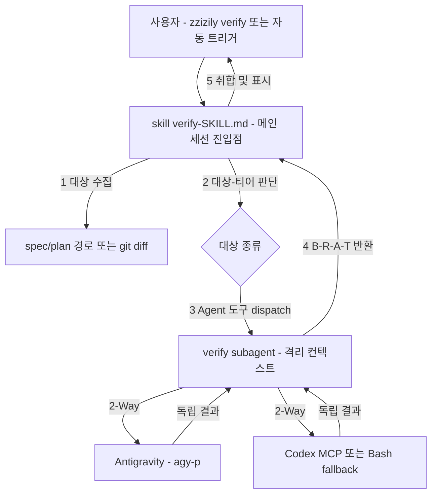
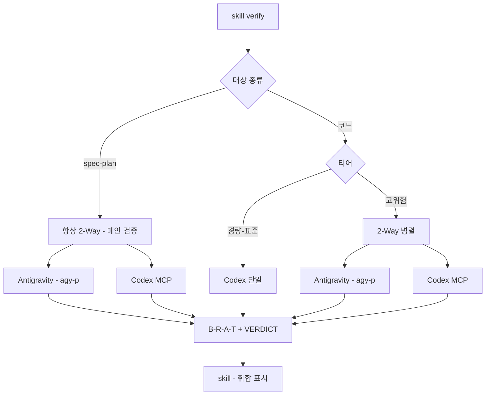

# zzizily 검증 컴포넌트 설계 (skill + subagent 하이브리드)

> **Date**: 2026-07-15
> **Status**: Draft (brainstorming → spec)
> **Topic**: 05-multi-agent.md 검증 체계를 zzizily 플러그인의 독립 컴포넌트로 이관

## 목차

- [개요](#개요)
- [배경 및 동기](#배경-및-동기)
- [아키텍처](#아키텍처)
- [데이터 흐름](#데이터-흐름)
- [subagent 상세 구성](#subagent-상세-구성)
- [Codex Fallback (Plan B)](#codex-fallback-plan-b)
- [라우팅 매핑](#라우팅-매핑)
- [rules 이관 처리](#rules-이관-처리)
- [파일 구조 및 plugin.json](#파일-구조-및-pluginjson)
- [OMC 차별화](#omc-차별화)
- [성공 기준](#성공-기준)
- [범위 외 (YAGNI)](#범위-외-yagni)

## 개요

`~/.claude/rules/05-multi-agent.md`에 정의된 multi-agent 검증 체계(3단계 티어, Codex+Antigravity 2-Way 교차검증, B/R/A/T 출력 포맷)를 zzizily 플러그인의 독립 컴포넌트로 이관한다.

형태는 **하이브리드**: skill(`/zzizily:verify`)이 진입점·판사 역할을 담당하고, subagent(`verify`)가 격리 컨텍스트에서 Codex+Antigravity 2-Way 검증을 자동 실행한다.

검증 대상:
1. superpowers에서 생성한 spec/plan (문서) — **메인 검증, 항상 2-Way**
2. AI agent 생산물 (코드, PR diff) — 티어 기반 라우팅

## 배경 및 동기

### rules → 독립 컴포넌트 이관

기존 검증 체계는 `~/.claude/rules/05-multi-agent.md`에 전역 지침으로 존재한다. Claude가 읽고 메인 세션에서 수동으로 `agy -p`/`mcp__codex__codex`를 호출하는 절차다. 사용자는 이 검증 로직을 rules가 아닌 **독립적인 plugin 컴포넌트(subagent 또는 skill)로 분리**하길 원한다.

### skill vs subagent 결정

| 기준 | Skill | Subagent | 선택 |
| :--- | :--- | :--- | :--- |
| 격리 / 자기편향 방지 | ✗ 메인 세션 = 작성자 컨텍스트 공유 | ✓ 독립 컨텍스트 | **subagent** |
| 병렬 2-Way | △ Claude 순차 호출 | ✓ 동시 dispatch | **subagent** |
| 메인 컨텍스트 절약 | ✗ 절차가 메인 점유 | ✓ 결과만 반환 | **subagent** |
| 결과 일관성 | △ 매번 지침 해석 | ✓ 시스템 프롬프트 고정 | **subagent** |
| 사용자 능동 호출 | ✓ `/zzizily:verify` | △ Claude 재량 dispatch | **skill** |

검증의 본질적 요구인 "작성자-검증자 분리(자기 편향 방지)"를 구조적으로 보장하는 것은 subagent뿐이다. 단, 사용자 능동 호출 진입점이 필요하므로 skill을 진입점으로 두고 subagent가 실행을 담당하는 **하이브리드** 구조로 결정했다.

### OMC verifier/critic은 2-Way 자동화 안 함

OMC plugin의 `verifier`(`model: sonnet`)와 `critic`(`model: opus`) subagent를 실제 정의 파일에서 확인한 결과, 둘 다 **Claude Code 내장 도구(Bash/LSP/Grep/Read)로 직접 검증**하며 Codex/Gemini(Antigravity)를 호출하지 않는다.

- `verifier`: `npm test`, `npm run build`, `lsp_diagnostics_directory` 직접 실행 → Verification Report
- `critic`: Read/Grep/Glob/Bash(git)/LSP로 plan/code 리뷰 → VERDICT (REJECT/REVISE/ACCEPT)

즉 05-multi-agent.md의 "Codex+Antigravity 2-Way 교차검증"은 OMC subagent가 자동화하는 게 아니라 rules의 수동 절차로만 존재한다. **2-Way 교차검증 자동화는 OMC 어디에도 없는 빈 자리**이며, zzizily `verify`가 이 역할을 유일하게 담당한다.

### spec/plan은 항상 2-Way (메인 검증)

spec/plan은 zzizily `verify`의 메인 검증 대상이다. 05-multi-agent.md 원본 라우팅(Spec/Plan→Antigravity 보조 Codex)과 달리, **spec/plan은 티어와 무관하게 항상 Codex+Antigravity 2-Way**로 검증한다. 메인 검증 대상이므로 단일 에이전트 패스로 타협하지 않는다.

## 아키텍처



### 컴포넌트 분담

| 컴포넌트 | 역할 | 위치 |
| :--- | :--- | :--- |
| **skill** `verify` | 진입점. 대상 수집 → 대상/티어 판단 → subagent dispatch → 결과 취합·표시. 판사 역할(작업 불참). `/zzizily:verify` + 자동 트리거 키워드 | `skills/verify/SKILL.md` |
| **subagent** `verify` | 격리 컨텍스트에서 실제 검증. 05-multi-agent.md 절차(라우팅·2-Way·출력포맷) 이관. Codex/Antigravity 호출. B/R/A/T 반환 | `.claude-plugin/agents/verify.md` |

### 핵심 원칙 (05-multi-agent.md 정합)

- skill은 판사만 — 검증 작업에 참여 안 함. 자기 편향 방지
- subagent는 독립 컨텍스트 — 메인 세션 작업 기록 안 봄. 원본만 입력받아 판단
- 2-Way: 각 외부 에이전트(Antigravity/Codex)는 서로 결과 안 보고 독립 작업 → subagent가 양쪽 결과를 skill에 반환 → skill이 취합

## 데이터 흐름

1. 사용자 `/zzizily:verify` 호출 또는 자동 트리거(키워드: "검증", "verify", "리뷰해줘")
2. skill: 검증 대상 수집 (spec/plan 파일 경로, `git diff`, 대상 디렉토리)
3. skill: 대상 종류(spec/plan vs 코드) + 티어(경량/표준/고위험) 판단
4. skill: `Agent` 도구로 verify subagent dispatch (대상 + 대상종류 + 티어 전달)
5. subagent(격리): 라우팅 매핑에 따라 2-Way 또는 단일 호출. Codex는 [Plan B](#codex-fallback-plan-b) fallback 적용. 각각 독립 B/R/A/T 출력
6. subagent: 결과 반환 (텍스트)
7. skill: 결과 취합·표시. blocker 있으면 수정 권고

## subagent 상세 구성

### frontmatter

```yaml
---
name: verify
description: Codex+Antigravity 2-Way 교차검증 자동화. spec/plan·코드를 격리 컨텍스트에서 검증 후 B/R/A/T 반환.
model: opus          # 검증은 품질 우선 (OMC model-compatibility: Review=Opus 권장)
level: 3
disallowedTools: Write, Edit   # read-only
---
```

### 도구 세트

`disallowedTools: Write, Edit`로 쓰기 차단, 나머지 전체 허용(All tools):

| 도구 | 용도 |
| :--- | :--- |
| `Bash` | `agy -p` (Antigravity 호출), `codex exec` (Plan B fallback), git |
| `mcp__codex__codex` | Codex MCP 호출 (1차) |
| `mcp__codex__codex-reply` | Codex 대화 이어가기 |
| `Read`, `Grep`, `Glob` | 대상 파일 확인, 검증 컨텍스트 |

### 시스템 프롬프트 핵심 (05-multi-agent.md 이관)

subagent 시스템 프롬프트에 이관할 절차:

1. 입력(대상 + 대상종류 + 티어) 해석
2. [라우팅 매핑](#라우팅-매핑)에 따라 2-Way 또는 단일 결정
3. 2-Way 시 각 외부 에이전트에 **동일 입력** 전달, 서로 결과 보지 않고 독립 작업. 가능하면 한 메시지에서 동시 호출(병렬)
4. Codex는 [Plan B](#codex-fallback-plan-b) fallback 적용
5. 출력 포맷: B/R/A/T (Blocker/Risk/Assumption/Test) + VERDICT

### 출력 포맷

```text
## Verification Report

### Verdict
**Status**: PASS | FAIL | INCOMPLETE
**Target**: spec-plan | code
**Tier**: light | standard | high
**Routes used**: Antigravity(agy), Codex(MCP | Bash-fallback)

### Findings
- [Blocker] 즉시 수정 필요 — 증거(file:line 또는 인용)
- [Risk] 인지 필요, 수정 권장 — 증거
- [Assumption] 검증된 가정
- [Test] 제안 테스트 케이스

### Cross-Check (2-Way 시)
| 항목 | Antigravity | Codex | 일치여부 |
| :--- | :--- | :--- | :--- |
| ... | ... | ... | 일치/충돌 |

### Recommendation
APPROVE | REQUEST_CHANGES | NEEDS_MORE_EVIDENCE
[한 줄 근거]
```

충돌 시 [rules 이관 처리](#rules-이관-처리)의 충돌 해결 규칙 적용: 보안/권한·코드정확성은 Codex 우선, 아키텍처/설계는 Antigravity 우선, 최종 결정은 skill(개발자)이 판단.

## Codex Fallback (Plan B)

`mcp__codex__codex` MCP가 간헐적으로 불안정한 이슈에 대한 fallback:

```text
1차: mcp__codex__codex (MCP)
     - 구조화 응답, codex-reply로 대화 이어가기 가능
     - 실패 감지: 도구 에러 반환 / 타임아웃(5m) / 빈·불완전 응답

2차(Plan B): codex exec (Bash)
     - PR·코드 검증: codex exec review --uncommitted  또는  codex exec review --base <BRANCH>
     - 일반 검증:      codex exec "<검증 프롬프트>"   (stdin로 대상 전달)
     - 파라미터:       --sandbox workspace-write -a on-failure  (05-multi-agent.md 기본값)

결과 표시: "Codex: MCP" 또는 "Codex: Bash fallback (사유: MCP <에러>)"
```

Antigravity는 이미 Bash(`agy -p`)만 사용하므로 폴백 불필요. `agy -p` 실패 시 모델 폴백(`Gemini 3.1 Pro` → `Gemini 3.5 Flash`)은 05-multi-agent.md에 이미 정의되어 subagent 시스템 프롬프트에 동일 적용.

## 라우팅 매핑

skill이 대상 종류(spec/plan vs 코드) + 티어 판단. spec/plan은 메인 검증이므로 항상 2-Way.



| 대상 | 조건 | 라우팅 | 종료 조건 |
| :--- | :--- | :--- | :--- |
| spec/plan | (항상 — 메인 검증) | Codex + Antigravity **2-Way 병렬** | 양쪽 blocker 0, 충돌 해결 |
| 코드 | 경량 (문서/설정/minor 의존성) | Codex 단일 (`codex exec review --uncommitted`) | blocker 0 |
| 코드 | 표준 (일반 기능/버그/리팩토링) | Codex 단일 (승격조건 충족 시 2-Way) | blocker 0, non-blocker 확인 |
| 코드 | 고위험 (아래 승격조건) | Codex + Antigravity **2-Way 병렬** | 양쪽 blocker 0, 충돌 해결 |

고위험 승격조건 (05-multi-agent.md 기반):
- 인증/권한/비밀값/네트워크 경계 변경
- 데이터 모델/마이그레이션 변경
- 배포 파이프라인/infra 변경
- public API/CLI 호환성 변경
- 대규모 삭제/리팩토링 (100줄+)
- 롤백이 어려운 변경

## rules 이관 처리

`~/.claude/rules/05-multi-agent.md`에서 검증 절차만 zzizily로 이관, 인프라 설정은 rules에 잔류.

| rules 섹션 | 처리 |
| :--- | :--- |
| Verification Workflow ~ 충돌 해결 규칙 (3단계 티어, 2-Way, 라우팅, B/R/A/T, 충돌해결) | **zzizily `verify` subagent 시스템 프롬프트로 이관. rules에서 해당 섹션 삭제** (참조 한 줄도 남기지 않음 — 검증은 `/zzizily:verify`로만) |
| Provider Models, Codex MCP 설정/파라미터, Antigravity CLI 사용법, K8sGPT/Holmes/Serena 도메인 에이전트 | **rules에 유지** (도구 설정, 검증 절차 아님) |

rules 전체 삭제가 아닌 이유: 인프라 설정(모델 목록, Codex config.toml, Antigravity 호출 방식, K8sGPT/Holmes/Serena 역할)은 검증 절차가 아닌 도구 설정이므로 rules가 Source of Truth로 유지. 역할 분리: 에이전트 설치는 zzizily `agents` 스킬, 설정은 rules, 검증 실행은 zzizily `verify`.

spec/plan 항상 2-Way 변경은 05-multi-agent.md 원본 라우팅(Spec/Plan→Antigravity 보조 Codex)에서 의도적 강화. subagent 시스템 프롬프트에 이 변경을 반영하여 이관.

## 파일 구조 및 plugin.json

```
.claude-plugin/
  plugin.json                    # "agents" 필드 추가 (zzizily 최초 agent 도입)
  agents/
    verify.md                    # 신규 subagent
skills/
  verify/
    SKILL.md                     # 신규 skill (진입점)
```

`plugin.json` 변경:

```json
{
  "name": "zzizily",
  "version": "1.7.0",
  "author": { "name": "Crong" },
  "skills": "./skills/",
  "agents": "./.claude-plugin/agents/"
}
```

버전은 minor 업그레이드(1.6.0 → 1.7.0): 신규 기능(검증 컴포넌트) 추가, 기존 스킬 영향 없음. plugin.json과 marketplace.json 버전 동기화 필수.

CLAUDE.md 업데이트:
- 구조 다이어그램에 `.claude-plugin/agents/` 추가
- 스킬 카탈로그에 `verify` 행 추가 — [분류 원칙](#범위-외-yagni)상 **AI Agent·배포 그룹**에 배치 (개발 워크플로우 검증 도구. 보안 탐지/대응이 아닌 품질 검증이므로 보안·감사 그룹 제외)
- 환경별 패키지 관리 섹션에 agents 컴포넌트 언급

## OMC 차별화

zzizily `verify`는 OMC의 verifier/critic과 역할이 다르다:

| 항목 | OMC verifier/critic | zzizily verify |
| :--- | :--- | :--- |
| 검증 방식 | Claude 내장 도구(Bash/LSP/Grep) 직접 실행 | Codex+Antigravity 외부 에이전트 2-Way |
| 교차검증 | 단일 에이전트 | 2-Way 병렬 + 취합 |
| 라우팅 | 없음 (단일 패스) | 대상종류(spec/plan vs 코드) + 3단계 티어 |
| spec/plan | 단일 패스 | 항상 2-Way (메인 검증) |
| 출력 | Verification Report / VERDICT | B/R/A/T + VERDICT + Cross-Check |
| model | sonnet(verifier) / opus(critic) | opus |

차별화 핵심: **Codex+Antigravity 2-Way 교차검증 자동화 + spec/plan 항상 2-Way + 3단계 티어 라우팅**. 시스템 프롬프트에 이 차이 명시하여 OMC subagent와 중복 인식 방지.

## 성공 기준

1. `/zzizily:verify` 호출 시 skill이 대상 식별 → subagent dispatch → 결과 표시
2. **spec/plan 대상은 항상 Codex+Antigravity 2-Way 병렬 실행**, Cross-Check 표 출력 (티어 무관)
3. 코드 대상은 티어(경량/표준/고위험)에 따라 정확히 분기, 고위험 시 2-Way
4. `mcp__codex__codex` 실패 시 `codex exec` Bash fallback 자동 전환, 결과에 경로 표시
5. 05-multi-agent.md 검증 절차가 zzizily subagent 시스템 프롬프트로 이관, rules에는 인프라 설정만 잔류
6. blocker 0개일 때만 APPROVE, 아니면 REQUEST_CHANGES

## 범위 외 (YAGNI)

- **subagent 다중 분할** (verifier-spec, verifier-code 분리): 단일 subagent가 라우팅으로 충분. 복잡도 증가 불필요
- **rules 전체 삭제**: 인프라 설정은 rules 유지
- **자동 수정(autofix)**: 검증만 수행, 수정은 개발자 판단. skill은 권고만
- **K8sGPT/Holmes/Serena 통합**: 인프라/런타임 검증은 별개 도메인. zzizily verify는 spec/plan·코드에 한정. 향후 필요시 확장
- **cron 기반 정기 검증**: 수동/트리거 기반만. 자동화는 별도 스킬(exchange-rate-tracker 패턴) 고려 시점에 논의
