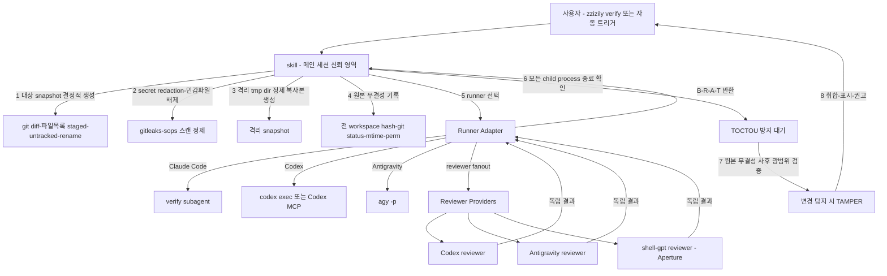

# Verify

spec/plan·코드를 runtime-neutral 방식으로 교차검증. **skill은 신뢰 영역(진입점 + 보안 책임 + 판사)**, **runner는 실행 주체**, **reviewer는 순수 검증 provider**. 검증 대상의 prompt injection으로 reviewer가 조종될 수 있다는 전제로, 보안 결정권은 skill만 보유.

## Usage

```text
/zzizily:verify                          → 현재 git diff (staged/unstaged) 검증
/zzizily:verify <path>                   → 지정 파일/디렉토리 검증
/zzizily:verify docs/specs/xxx.md        → spec/plan 문서 검증 (항상 2-Way)
/zzizily:verify <path> --runner codex    → Codex에서 실행 가능한 경로로 검증
/zzizily:verify <path> --runner agy      → Antigravity에서 실행 가능한 경로로 검증
/zzizily:verify <path> --runner codex --reviewers agy
                                           → Codex 사용 중 필수 agy CLI 검증
/zzizily:verify <path> --runner codex --reviewers agy,sgpt --model sgpt:k3-256k
                                           → Codex 사용 중 agy 필수 + shell-gpt 선택 검증
/zzizily:verify <path> --runner agy --reviewers codex
                                           → Antigravity 사용 중 필수 Codex 검증
/zzizily:verify <path> --runner agy --reviewers codex,sgpt --model sgpt:glm-5.2
                                           → Antigravity 사용 중 Codex 필수 + shell-gpt 선택 검증
/zzizily:verify <path> --reviewers codex,sgpt --model sgpt:kimi-for-coding
                                           → shell-gpt + Tailscale Aperture coding 모델 포함 검증
/zzizily:verify <path> --reviewers codex,sgpt --model sgpt:k3
                                           → shell-gpt + Tailscale Aperture 모델 포함 검증
/zzizily:verify <path> --reviewers codex,sgpt --model sgpt:k3-256k
                                           → shell-gpt + Tailscale Aperture 256k Kimi 모델 포함 검증
/zzizily:verify <path> --reviewers codex,sgpt --model sgpt:glm-5.2
                                           → shell-gpt + Tailscale Aperture GLM 모델 포함 검증
/zzizily:verify <path> --reviewers codex,sgpt --model sgpt:deepseek-v4-pro-260425
                                           → shell-gpt + Tailscale Aperture DeepSeek 모델 포함 검증
/zzizily:verify <path> --reviewers codex,sgpt --model sgpt:seed-2-0-pro-260328
                                           → shell-gpt + Tailscale Aperture Seed 모델 포함 검증
```

자동 트리거: 사용자 명시적 입력에서 "검증", "verify", "리뷰해줘" + 검증 대상 감지 시 호출.

**제외 필터 (무한 루프 방지)**: 아래 상태에서는 자동 트리거 금지.

- 이미 `/zzizily:verify` 실행 중
- 직전 Verification Report 출력 중
- 세션 opt-out 플래그 활성
- 자기 자신의 검증 결과를 다시 "검증" 대상으로 감지

## 아키텍처 (v4)



| 컴포넌트 | 역할 | 위치 |
| :--- | :--- | :--- |
| **skill** `verify` | 진입점 + **보안 책임**(snapshot/redaction/무결성 감시) + 판사(취합). runtime-neutral 계약 정의 | `skills/verify/SKILL.md` |
| **runner adapter** | Claude Code/Codex/Antigravity 중 현재 실행 환경에 맞춰 reviewer fanout 수행 | skill 본문 계약 |
| **subagent** `verify` | Claude Code runner adapter. 격리 snapshot에서 순수 검증만 수행. 보안 결정권 없음 | `agents/verify.md` |
| **reviewer provider** | Codex, Antigravity, shell-gpt(Aperture) 등 독립 검증 결과 생산 | CLI/MCP |

## 실행 주체와 reviewer 분리

| 축 | 값 | 의미 |
| :--- | :--- | :--- |
| `runner` | `auto` \| `claude` \| `codex` \| `agy` | snapshot 이후 fanout을 실제로 실행하는 주체. 기본 `auto` |
| `reviewers` | `codex`, `agy`, `sgpt` 조합 | 독립 검증 결과를 내는 provider. `runner=claude`에서는 `codex,agy` 필수, `runner=codex`에서는 `agy` 필수, `runner=agy`에서는 `codex` 필수, `sgpt` 선택 |
| `model_profile` | provider별 모델 지정 | `codex:gpt-5.6-sol`, `codex:gpt-5.6-terra`, `codex:gpt-5.6-luna`, `agy:gemini-3.6-flash`, `sgpt:kimi-for-coding`, `sgpt:k3`, `sgpt:k3-256k`, `sgpt:glm-5.2`, `sgpt:deepseek-v4-pro-260425`, `sgpt:seed-2-0-pro-260328` 형태 |

`runner`는 orchestration 위치만 바꾼다. 보안 책임(snapshot/redaction/integrity)은 항상 skill이 먼저 수행하고, reviewer는 격리 복사본만 본다.

### Runner 선택

| runner | 사용 조건 | 실행 방식 |
| :--- | :--- | :--- |
| `auto` | 기본값 | 현재 host가 제공하는 가장 안전한 runner 선택. Claude Code면 subagent, Codex면 local fanout, agy면 `agy -p` |
| `claude` | Claude Code plugin/subagent 사용 가능 | `Agent(subagent_type: "verify")`로 fanout. 필수 reviewer는 `codex,agy`, 선택 reviewer는 `sgpt` |
| `codex` | Codex 세션 또는 `codex exec` 사용 가능 | Codex가 runner가 되고 `agy CLI`를 필수 reviewer로 호출. `sgpt`는 선택 |
| `agy` | Antigravity CLI 사용 가능 | Antigravity가 runner가 되고 `codex` reviewer를 필수 호출. Codex 검증은 MCP 우선, CLI 차선. `sgpt`는 선택 |

### Claude Runner 정책

사용자가 Claude Code를 사용 중이면 `runner=claude`로 간주한다. 이때 검증은 항상 아래처럼 수행한다.

| 구분 | reviewer | 실행 경로 | 정책 |
| :--- | :--- | :--- | :--- |
| 필수 | `codex` | Codex MCP 우선, 실패 시 `codex exec --sandbox read-only` fallback | 생략 불가 |
| 필수 | `agy` | `agy -p` CLI | 생략 불가 |
| 선택 | `sgpt` | shell-gpt + Tailscale Aperture profile | `--reviewers ... ,sgpt` 또는 `--model sgpt:<model>` 지정 시 추가 |

Claude runner에서 사용자가 `--reviewers codex`처럼 일부만 지정해도 `agy`를 자동 보강해 `codex,agy`로 실행한다. Claude Code에서 Codex 검증은 **MCP 우선, `codex exec` CLI 차선**이다. `sgpt`는 명시적으로 요청된 경우에만 추가한다.

### Codex Runner 정책

사용자가 Codex를 사용 중이면 `runner=codex`로 간주한다. 이때 검증은 자기검증만으로 끝내지 않고 외부 reviewer를 반드시 붙인다.

| 구분 | reviewer | 실행 경로 | 정책 |
| :--- | :--- | :--- | :--- |
| 필수 | `agy` | `agy -p` CLI | 생략 불가 |
| 선택 | `sgpt` | shell-gpt + Tailscale Aperture profile | `--reviewers ... ,sgpt` 또는 `--model sgpt:<model>` 지정 시 추가 |

Codex runner에서 사용자가 `--reviewers codex`만 지정해도 `agy`를 자동 보강한다. 단, Codex 사용 중 최소 검증 경로는 **`agy CLI` 필수 + `sgpt` 선택**이다. `sgpt`는 명시적으로 요청된 경우에만 추가한다.

### Antigravity Runner 정책

사용자가 Antigravity CLI를 사용 중이면 `runner=agy`로 간주한다. 이때 검증은 Antigravity 자기검증만으로 끝내지 않고 Codex reviewer를 반드시 붙인다.

| 구분 | reviewer | 실행 경로 | 정책 |
| :--- | :--- | :--- | :--- |
| 필수 | `codex` | Codex MCP 우선, 실패 시 `codex exec --sandbox read-only` fallback | 생략 불가 |
| 선택 | `sgpt` | shell-gpt + Tailscale Aperture profile | `--reviewers ... ,sgpt` 또는 `--model sgpt:<model>` 지정 시 추가 |

Antigravity runner에서 사용자가 `--reviewers agy`만 지정해도 `codex`를 자동 보강한다. 최소 검증 경로는 **`codex` 필수 + `sgpt` 선택**이고, Codex 검증은 **MCP 우선, `codex exec` CLI 차선**이다.

### Reviewer Provider

| reviewer | 기본 호출 | 모델 선택 |
| :--- | :--- | :--- |
| `codex` | Codex MCP 우선, 실패 시 `codex exec` | `provider_config.codex_model` |
| `agy` | `agy -p` | `provider_config.agy_model` |
| `sgpt` | `sgpt` CLI | `provider_config.sgpt_model`, Tailscale Aperture endpoint/profile. 연결 모델: `kimi-for-coding`, `k3`, `k3-256k`, `glm-5.2`, `deepseek-v4-pro-260425`, `seed-2-0-pro-260328` |

### Codex 모델 선택

| 모델 | 선택 상황 | 피할 상황 |
| :--- | :--- | :--- |
| `gpt-5.6-sol` | 기본값. high-risk code review, architecture, 보안/권한 경계, 충돌 resolution, 최종 verdict처럼 reasoning 품질이 중요한 검증 | 단순 typo/doc 변경, 빠른 존재 확인 |
| `gpt-5.6-terra` | 공식 docs/reference 확인, dependency/API 동작 검증, 외부 근거 기반 비교처럼 research 성격이 강한 검증 | 순수 local diff patch review만 필요한 경우 |
| `gpt-5.6-luna` | 빠른 triage, small diff sanity check, 파일/심볼 mapping, 저위험 문서 변경 검증 | security/auth/data migration, 복잡한 cross-file reasoning |

기본 선택:

1. 불확실하면 `codex:gpt-5.6-sol`.
2. 외부 문서·API·dependency 근거가 핵심이면 `codex:gpt-5.6-terra`.
3. 빠른 저위험 확인이면 `codex:gpt-5.6-luna`.
4. blocker 여부나 reviewer 간 충돌 판단은 `gpt-5.6-sol`로 승격한다.

### Antigravity 모델 선택

| 모델 | 선택 상황 | 피할 상황 |
| :--- | :--- | :--- |
| `gemini-3.6-flash` | 기본 fast lane. low/medium-risk diff, 실행 계획 sanity check, agent workflow 빠른 검토, Codex runner의 필수 외부검증을 낮은 latency로 붙일 때 | high-risk security/auth/data migration, 복잡한 architecture verdict |
| `gemini-pro` | high-risk design/code review, multi-file consistency, 긴 계획 검증, Flash 결과가 애매하거나 Codex와 충돌할 때 | 단순 small diff 검증 |

기본 선택:

1. Codex runner의 필수 `agy` reviewer는 기본 `agy:gemini-3.6-flash`.
2. 보안/권한/데이터/배포 영향이 있거나 reviewer 충돌이 있으면 `agy:gemini-pro`로 승격한다.
3. latency가 더 중요하고 변경이 저위험이면 `gemini-3.6-flash`를 유지한다.

`sgpt`는 shell-gpt가 Tailscale Aperture(AI Gateway)에 연결된 상태를 전제한다. 현재 명시 모델은 `kimi-for-coding`, `k3`, `k3-256k`, `glm-5.2`, `deepseek-v4-pro-260425`, `seed-2-0-pro-260328`다. skill은 API key·gateway URL을 출력하거나 평문 저장하지 않는다. 모델명/profile만 `provider_config`에 전달한다.

### Aperture 모델 선택

| 모델 | 선택 상황 | 피할 상황 |
| :--- | :--- | :--- |
| `kimi-for-coding` | single-file/small-diff 구현 검토, 코드 생성·수정안 품질, 빠른 coding reviewer가 필요할 때 | repo-wide architecture, 복잡한 tool orchestration, 긴 spec 검증 |
| `k3-256k` | 중대형 diff, 여러 파일 consistency, 일반 repo 문맥이 256k 안에 들어오는 검증 | 256k를 넘는 장문 spec/monorepo 검증, 장기 planning |
| `k3` | 긴 spec/plan, 대형 diff, cross-file consistency, 긴 문맥을 유지해야 하는 설계 검증 | latency/cost가 더 중요한 짧은 코드 리뷰 |
| `glm-5.2` | agent workflow, tool-use 경계, API/권한/상태 전이, 실행 계획 검증처럼 orchestration 판단이 중요한 경우 | 순수 코드 패치 품질만 빠르게 보고 싶을 때 |
| `deepseek-v4-pro-260425` | 복잡한 bug 추론, 알고리즘/동시성/성능 리스크, 코드 경로별 edge case 검증 | 문서/계획 위주 검증, tool orchestration 판단 |
| `seed-2-0-pro-260328` | 넓은 대안 검토, spec 타당성, product/architecture trade-off, Kimi/GLM과 다른 관점의 sanity check | line-level patch correctness만 필요한 경우 |

기본 선택:

1. 코드 diff가 작고 구현 품질 중심이면 `sgpt:kimi-for-coding`.
2. 중대형 코드 변경이 256k 안에 들어오면 `sgpt:k3-256k`.
3. spec/plan 또는 256k를 넘는 장문 검증이면 `sgpt:k3`.
4. agent/tool/workflow/권한 경계 검증이면 `sgpt:glm-5.2`.
5. 복잡한 bug/알고리즘/성능 리스크 검증이면 `sgpt:deepseek-v4-pro-260425`.
6. spec/architecture trade-off를 다른 관점으로 한 번 더 보고 싶으면 `sgpt:seed-2-0-pro-260328`.
7. 불확실하면 `codex,agy` 기본 2-Way에 `sgpt:glm-5.2`를 추가한다. GLM을 tie-breaker로 쓰고, 코드 patch detail은 Codex/Kimi/DeepSeek 의견을 우선한다.

## 외부 전송 동의

**최초 1회** 외부 provider(Codex/Antigravity/shell-gpt gateway) 전송 동의 필요.

| 방식 | 설명 |
| :--- | :--- |
| Project-level 사전 동의 | `.omc/` 또는 프로젝트 설정에 동의 기록 시 재확인 없이 진행 |
| 첫 호출 확인 | 미동의 상태에서 첫 호출 시 사용자에게 1회 확인. 동의 시 세션 내 재사용 |

**미동의 시**: 외부 provider 전송 금지 → 수동 검증 안내 후 종료. 검증 결과의 Integrity는 항상 `Consent: DENIED`로 표기.

## 보안 책임 (v3 핵심)

skill(메인 세션, 신뢰 영역)이 모든 보안 결정을 담당. dogfood 2라운드에서 확인된 핵심: subagent가 보안 검증을 자체 수행하면 검증 대상의 prompt injection에 조종되어 무력화됨.

### 1. 대상 snapshot 결정적 생성

```bash
# 검증 대상 파일 목록 (staged + unstaged + untracked + rename/delete/binary)
git diff --name-status HEAD                 # tracked 변경 (staged + unstaged)
git ls-files --others --exclude-standard    # untracked (신규)
git diff --find-renames --name-only         # rename 감지
git diff --diff-filter=D --name-only        # delete 감지
git diff --numstat                          # binary/대용량 감지 (-	- 형태)
```

| 케이스 | 처리 |
| :--- | :--- |
| staged + unstaged 혼합 | 양쪽 모두 포함 (작업 중인 전체 변경) |
| untracked 신규 파일 | `git add -N --intent-to-add` 후 diff에 포함 |
| rename | `--find-renames`로 감지, 신·구 모두 스캔 |
| delete | 삭제된 파일의 마지막 커밋 내용을 diff에 포함 |
| binary | `--numstat`으로 `-` 표기 감지, text 취급 불가 → 별도 표기 |
| 대용량 (1MB+) | diff 잘림 방지를 파일 단위 전달 |

대상 외 파일(변경 없는 파일)은 snapshot에서 제외. 단, 무결성 기록은 **전 workspace** 대상 (아래 참조).

### 2. Secret redaction (fail-closed)

```bash
# gitleaks 스캔 (설치 확인)
command -v gitleaks || { echo "FAIL-CLOSED: gitleaks 미설치"; exit 1; }

# 검증 대상 파일 대상 secret 스캔
gitleaks detect --source "$TARGET" --no-banner --redact --report-format json --report-path "$(mktemp /tmp/gitleaks-XXXXXX.json)"

# sops 암호화 파일 감지 (이미 암호화된 secret은 추가 처리 불필요)
find "$TARGET" -name '*.sops' -o -name '.sops.yaml' 2>/dev/null

# 매칭 시 [REDACTED] 치환
# binary/base64/분할 secret/encrypted 패턴도 동일하게 스캔
```

| 조건 | 처리 |
| :--- | :--- |
| gitleaks 매칭 | 매칭 라인 `[REDACTED]` 치환 후 snapshot 포함 |
| sops 암호화 파일 | 이미 암호화되어 있으므로 그대로 포함 (평문 아님) |
| **scanner 실패/미설치** | **fail-closed**: 검증 중단. INCOMPLETE 리포트 |

### 3. 민감 파일 배제

snapshot 생성 시 아래 패턴은 원천 제외.

```bash
# 배제 패턴 (rsync --exclude 또는 find 필터)
EXCLUDE_PATTERNS=(
  '.env*'           # 환경변수 (평문 secret 가능)
  '*.key'           # 개인키
  '*.pem'           # 인증서/키
  '.sops'           # sops 메타데이터
  '.gitleaks.toml'  # gitleaks 설정 (allowlist로 secret 우회 가능)
  '.codex/'         # Codex config (API key 등)
  '.config/**'      # 사용자 config (토큰 가능)
  '.aws/'           # AWS credential
  '.ssh/'           # SSH 키
  '.gnupg/'         # GPG 키링
)
```

### 4. 격리 tmp directory 정제 복사본 생성

```bash
# 프로세스별 고유 격리 dir
ISOLATED_DIR=$(mktemp -d /tmp/verify-isolated-XXXXXX)

# 정제 복사본 생성 (배제 패턴 + redaction 적용된 파일만)
# 대상 snapshot 파일만 복사 (전 workspace 아님)
# EXCLUDE_PATTERNS 전체를 rsync --exclude로 전달 (secret exfiltration 방지)
rsync -av --files-from <(echo "$TARGET_FILES") \
  --exclude '.env*' --exclude '*.key' --exclude '*.pem' \
  --exclude '.sops' --exclude '.gitleaks.toml' \
  --exclude '.codex/' --exclude '.config/**' \
  --exclude '.aws/' --exclude '.ssh/' --exclude '.gnupg/' \
  "$WORKSPACE/" "$ISOLATED_DIR/"

# 확인: 격리 dir에 민감 파일이 없어야 함 (EXCLUDE_PATTERNS 전체 검사)
find "$ISOLATED_DIR" \( \
  -name '.env*' -o -name '*.key' -o -name '*.pem' \
  -o -name '.sops' -o -name '.gitleaks.toml' \
  -o -name '.codex' -o -path '*/.config/*' \
  -o -name '.aws' -o -name '.ssh' -o -name '.gnupg' \
\) -print | grep -q . && {
  echo "FAIL-CLOSED: 격리 snapshot에 민감 파일 잔류"; exit 1; }
```

**원본 workspace 접근 차단**: runner/reviewer의 `cwd`를 격리 dir로 강제. 원본 workspace 경로는 전달하지 않음.

### 5. 원본 무결성 기록 (검증 전)

**전 workspace** 상태를 기록. 대상 파일뿐 아니라 대상 외·metadata까지 사후 검증 범위.

```bash
# tracked 파일 hash
INTEGRITY_TRACKED_PRE=$(mktemp /tmp/verify-integrity-tracked-XXXXXX.txt)
git ls-files | xargs shasum -a 256 > "$INTEGRITY_TRACKED_PRE"

# untracked 파일 hash (무결성 감시 대상)
INTEGRITY_UNTRACKED_PRE=$(mktemp /tmp/verify-integrity-untracked-XXXXXX.txt)
git ls-files --others --exclude-standard | sort | xargs -r shasum -a 256 > "$INTEGRITY_UNTRACKED_PRE"

# git status 스냅샷
INTEGRITY_STATUS_PRE=$(mktemp /tmp/verify-integrity-status-XXXXXX.txt)
git status --porcelain=v1 --branch > "$INTEGRITY_STATUS_PRE"

# 파일 metadata (mtime, permission)
INTEGRITY_META_PRE=$(mktemp /tmp/verify-integrity-meta-XXXXXX.txt)
find . -type f \( ! -path './.git/*' \) -exec stat -f '%m %Sp %N' {} \; > "$INTEGRITY_META_PRE"
```

## dispatch 실행 계약

```text
도구: Agent(Claude runner) 또는 codex/agy CLI runner
subagent: verify (namespace zzizily:verify, Claude runner에서만 사용)
입력(자연어 지시에 포함):
  - isolated_cwd: 격리 tmp directory 절대경로
  - target_kind: spec-plan | code
  - target_files: 격리 복사본 내 상대경로 목록
  - tier: light | standard | high (코드만)
  - acceptance_criteria: 선택
  - runner: auto | claude | codex | agy
  - reviewers: codex,agy,sgpt 중 1개 이상. runner=claude에서는 codex,agy 필수 + sgpt 선택. runner=codex에서는 agy 필수 + sgpt 선택. runner=agy에서는 codex 필수 + sgpt 선택
  - provider_config: Codex model/sandbox, Antigravity 모델, shell-gpt Aperture model/profile
반환: runner 최종 메시지 = Verification Report
미발견 처리: Claude subagent discovery 실패 시 runner를 codex 또는 agy로 fallback. fallback 불가 시 에러 리포트 출력 후 종료
```

### Claude runner 호출 예시

```
Agent(
  subagent_type: "verify",
  description: "교차검증 (격리 snapshot)",
  prompt: """
isolated_cwd: /tmp/verify-isolated-aB3xY
target_kind: spec-plan
target_files:
  - docs/specs/2026-07-15-feature.md
  - plans/implementation-plan.md
tier: (spec-plan은 무시)
acceptance_criteria: (선택) "모든 섹션이 구현 가능한 단위로 분할되어 있을 것"
provider_config:
  runner: claude
  reviewers: codex,agy
  codex_model: gpt-5.6-sol
  codex_sandbox: read-only
  agy_model: gemini-3.6-flash
  sgpt_model: glm-5.2
  sgpt_gateway: tailscale-aperture

격리 복사본으로 reviewer fanout 검증 후 Verification Report 반환.
  """
)
```

### Codex runner 예시

```text
codex exec "<검증 프롬프트>" --sandbox read-only --config approval-policy=never --cd <격리dir>
```

### Antigravity runner 예시

```text
agy -p "<검증 프롬프트>" <격리dir>
```

### Discovery 실패 처리

Claude runner에서 subagent `verify`가 발견되지 않으면 `runner=codex` 또는 `runner=agy` fallback을 시도한다. fallback 불가 시 에러 리포트 출력 후 종료한다.

```text
[ERROR] verify subagent discovery 실패
확인 사항:
  1. plugin 설치 상태 (claude plugin list | grep zzizily)
  2. agents/verify.md 존재 확인 (플러그인 루트 자동 발견, plugin.json 필드 불필요)
  3. /reload-plugins 실행 후 재시도
```

## 무결성 사후 검증 (TOCTOU 방지)

runner 반환 후, **모든 child process 종료를 확인한 뒤** 원본 무결성을 광범위하게 재측정·비교. timeout으로 잔존한 process가 검증 후 원본을 변경하는 TOCTOU(Time-of-Check-to-Time-of-Use) 공격 방지.

```bash
# 1. child process 종료 게이트
# 주 게이트: runner dispatch는 동기식 — runner 및 하위 reviewer 호출이 완전히 종료된 후에만 반환.
# 아래 폴링은 timeout으로 잔존할 수 있는 고아 프로세스 정리 대기 (벨트 서스펜더스)
for i in $(seq 1 60); do
  pgrep -f 'codex exec|agy -p|sgpt' >/dev/null 2>&1 || break
  sleep 1
done
# 잔존 시 경고 후에도 무결성 검증 진행 (잔존 = timeout 프로세스)
pgrep -f 'codex exec|agy -p|sgpt' >/dev/null 2>&1 && echo "WARNING: 외부 검증 프로세스 잔존 가능"

# 2. 전 workspace 무결성 재측정 (검증 전과 동일 항목)
INTEGRITY_TRACKED_POST=$(mktemp /tmp/verify-integrity-tracked-post-XXXXXX.txt)
git ls-files | xargs shasum -a 256 > "$INTEGRITY_TRACKED_POST"
INTEGRITY_UNTRACKED_POST=$(mktemp /tmp/verify-integrity-untracked-post-XXXXXX.txt)
git ls-files --others --exclude-standard | sort | xargs -r shasum -a 256 > "$INTEGRITY_UNTRACKED_POST"
INTEGRITY_STATUS_POST=$(mktemp /tmp/verify-integrity-status-post-XXXXXX.txt)
git status --porcelain=v1 --branch > "$INTEGRITY_STATUS_POST"
INTEGRITY_META_POST=$(mktemp /tmp/verify-integrity-meta-post-XXXXXX.txt)
find . -type f \( ! -path './.git/*' \) -exec stat -f '%m %Sp %N' {} \; > "$INTEGRITY_META_POST"

# 3. 비교 (tracked/untracked/metadata/대상 외/write→restore 모두)
diff "$INTEGRITY_TRACKED_PRE" "$INTEGRITY_TRACKED_POST"
diff "$INTEGRITY_UNTRACKED_PRE" "$INTEGRITY_UNTRACKED_POST"
diff "$INTEGRITY_STATUS_PRE" "$INTEGRITY_STATUS_POST"
diff "$INTEGRITY_META_PRE" "$INTEGRITY_META_POST"
```

| 결과 | 처리 |
| :--- | :--- |
| 차이 없음 | `Integrity: VERIFIED`. runner 결과 신뢰 |
| **차이 감지** | `Integrity: TAMPER-DETECTED`. 검증 무효 → Verdict `INCOMPLETE` |
| tracked 파일 변경 | runner/reviewer가 원본 수정 시도 (격리 우회 시도) |
| untracked 파일 생성 | runner/reviewer가 workspace에 파일 생성 |
| 대상 외 파일 변경 | runner/reviewer가 검증 대상 외 파일 조작 (prompt injection 의심) |
| metadata/permission 변경 | 권한 상승 또는 mtime 조작 |
| write → restore | 내용은 동일하나 mtime 변경 (숨겨진 수정 시도) |

## 취합 · 표시

runner의 Verification Report + skill의 Integrity 보고를 통합 표시.

```text
## Verification Result

### Verdict (runner)
**Status**: PASS | FAIL | INCOMPLETE
**Target**: spec-plan | code
**Tier**: light | standard | high
**Runner**: auto | claude | codex | agy
**Routes used**: Codex(MCP | Bash-fallback | failed), Antigravity(agy | failed), shell-gpt(Aperture | failed)

### Integrity (skill)
**Consent**: GRANTED | DENIED
**Redaction**: OK | FAIL-CLOSED(scanner 실패)
**Integrity**: VERIFIED | TAMPER-DETECTED

### Findings (runner, 출처 표기)
- [Blocker] 즉시 수정 필요 — 근거(file:line/인용) — 출처: Codex | Antigravity | shell-gpt | multiple
- [Risk] 수정 권장 — 근거 — 출처
- [Assumption] 검증된 가정 — 출처
- [Test] 제안 테스트 — 출처

### Cross-Check (2-Way 이상)
| 항목 | Codex | Antigravity | shell-gpt | 일치여부 | 충돌해결 |
| :--- | :--- | :--- | :--- | :--- | :--- |

### Recommendation
APPROVE | REQUEST_CHANGES | NEEDS_MORE_EVIDENCE
[한 줄 근거]
```

**blocker 존재 시**: 수정 권고 구체적으로 제시 (file:line 기준). **Integrity TAMPER 시**: 검증 결과 무효, 원인 조사 권고.

### 격리 tmp dir 정리

```bash
# 결과 표시 완료 후 격리 dir 정리 (민감 정보 잔류 방지)
rm -rf "$ISOLATED_DIR"
# 무결성 측정 파일도 정리
rm -f /tmp/integrity-*-*.txt /tmp/verify-isolated-* 2>/dev/null
```

## 데이터 흐름

1. 사용자 `/zzizily:verify [대상]` 또는 자동 트리거 (rules 최소 규칙 + 제외 필터)
2. **skill**: 외부 전송 동의 확인 (최초 1회). 미동의 시 수동 안내 종료
3. **skill**: 대상 snapshot 결정적 생성 (staged/unstaged/untracked/rename/delete/binary/대용량/혼합 우선순위)
4. **skill**: secret redaction + 민감 파일 배제 → 정제. scanner 실패 시 fail-closed
5. **skill**: 격리 tmp directory에 정제 복사본 생성
6. **skill**: 원본 무결성 기록 (전 workspace: tracked/untracked hash, git status, mtime, permission)
7. **skill**: runner 선택 후 dispatch (격리 cwd + 복사본 + config)
8. **runner**: 격리 복사본으로 reviewer fanout 검증. B/R/A/T 반환
9. **skill**: 모든 child process 종료 확인 (TOCTOU 방지 대기)
10. **skill**: 원본 무결성 사후 광범위 검증. 변경 시 TAMPER-DETECTED → INCOMPLETE
11. **skill**: 결과 취합·표시. blocker 있으면 수정 권고. 격리 tmp dir 정리

## 라우팅 매핑

| 대상 | 조건 | 라우팅 | 종료 조건 |
| :--- | :--- | :--- | :--- |
| spec/plan | (항상) | 기본 `codex,agy` **2-Way**. Claude runner는 `codex,agy` 필수, Codex runner는 `agy` 필수, Antigravity runner는 `codex` 필수. `sgpt` 선택 추가 | 요구 reviewer blocker 0, 충돌 해결 |
| 코드 | 경량 | Claude runner는 `codex,agy` 필수. Codex runner는 `agy` 필수. Antigravity runner는 `codex` 필수. 그 외 runner는 티어 기본값 적용 | blocker 0 |
| 코드 | 표준 | Claude runner는 `codex,agy` 필수. Codex runner는 `agy` 필수. Antigravity runner는 `codex` 필수. 그 외 runner는 티어 기본값 적용 | blocker 0, non-blocker 확인 |
| 코드 | 고위험 | 기본 `codex,agy` **2-Way**. Codex runner는 `agy` 필수, Antigravity runner는 `codex` 필수. `sgpt` 선택 추가 | 요구 reviewer blocker 0, 충돌 해결 |

티어 판정: **고위험 승격조건 최우선** (인증/권한/비밀값/네트워크 경계 변경, 데이터 모델/마이그레이션, 배포 파이프라인, public API 호환성, 대규모 삭제/리팩토링 100줄+, 롤백 어려운 변경). 설정/minor도 보안·호환성 영향 시 고위험.

## Key Rules

- **보안 책임 skill 전담**: redaction, 민감 파일 배제, 무결성 감시는 skill(신뢰 영역)만 수행. runner/reviewer는 보안 결정권 없음 (검증 대상 prompt injection 조종 가능성 전제)
- **격리 snapshot 필수**: runner/reviewer `cwd`=격리 tmp directory. 원본 workspace·`.env`·Codex config 접근 차단. 정제 복사본만 전달
- **secret redaction fail-closed**: gitleaks/sops scanner 실패 또는 미설치 시 검증 중단 (INCOMPLETE). 매칭 시 `[REDACTED]` 치환
- **민감 파일 원천 배제**: `.env*`, `*.key`, `*.pem`, `.sops`, `~/.codex/`, `~/.config/**` 등은 snapshot에서 제외
- **무결성 전 workspace 감시**: 검증 전후로 tracked/untracked/hash/git status/mtime/permission 전 항목 비교. 대상 외 변경도 TAMPER
- **TOCTOU 방지**: 모든 child process 종료 확인 후 무결성 사후 검증. timeout 잔존 process의 사후 쓰기 차단
- **Codex workspace-write 금지**: 모든 Codex 경로 `--sandbox read-only`, `cwd`=격리 dir. MCP-first, 실패 시 `codex exec` fallback (workspace-write 절대 금지)
- **Codex reviewer 우선순위**: Claude Code와 Antigravity CLI에서 Codex를 reviewer로 호출할 때는 MCP를 우선 사용하고, 실패/미발견/불완전 응답 시에만 `codex exec` CLI로 fallback
- **Claude runner 필수 2-Way**: Claude Code 사용 중에는 `codex(MCP)` + `agy CLI` 검증을 반드시 수행. `sgpt`는 선택 reviewer
- **Codex runner 필수 외부검증**: Codex 사용 중에는 `agy CLI` 검증을 반드시 수행. `sgpt`는 선택 reviewer
- **Antigravity runner 필수 외부검증**: Antigravity CLI 사용 중에는 `codex` 검증을 반드시 수행. Codex 경로는 MCP 우선, CLI 차선. `sgpt`는 선택 reviewer
- **shell-gpt secret 금지**: Tailscale Aperture endpoint/API key는 평문 출력·저장 금지. `sgpt` profile/model 이름만 전달
- **fail-closed 판정**: APPROVE는 (요구된 reviewer 성공) + blocker 0 + Integrity VERIFIED + Consent OK. timeout/빈 응답/요구 reviewer 실패/무결성 변경 → INCOMPLETE (CI/merge에서 FAIL 동급 차단)
- **spec/plan 항상 2-Way**: 티어 무관 최소 2개 reviewer로 검증. 기본은 `codex,agy`
- **외부 전송 동의 최초 1회**: 미동의 시 수동 검증 안내. 동의는 세션 또는 project-level
- **무한 루프 방지**: 자기 출력/실행 중 재트리거 금지 (제외 필터). rules 트리거는 최소 규칙만 잔류
- **격리 dir 정리**: 결과 표시 후 격리 tmp directory 및 무결성 측정 파일 삭제 (민감 정보 잔류 방지)
- **한국어 리포트**: 결과는 항상 한국어로 출력. finding은 provider 출처(Codex | Antigravity | shell-gpt | multiple) 표기
