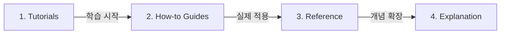

# Diátaxis Documentation Framework Reference

본 참조 문서는 리포지토리 내 문서들을 **사용자의 목적**과 **작업의 성격**에 따라 4가지 영역으로 분류하는 Diátaxis(디아탁시스) 프레임워크 기준을 정의합니다.

---

## 1. Diátaxis 4가지 구조 및 매트릭스

Diátaxis는 **실습/행동(Practical)** vs **이론/지식(Theoretical)** 축과 **학습(Learning)** vs **작업/목적(Task/Goal)** 축으로 구성됩니다.

| 구분 | 학습 중심 (Learning) | 작업/목적 중심 (Task/Goal) |
| --- | --- | --- |
| **실습/행동 (Practical)** | **1. Tutorials (튜토리얼)** - 대상: 초보자/입문자 - 비유: 요리 교실 (선생님 가이드) - 타겟: `getting-started.md`, `quickstart.md`, `tutorial-*.md` | **2. How-to Guides (가이드)** - 대상: 실무자/특정 과제 수행자 - 비유: 요리 레시피 - 타겟: `how-to-*.md`, `deployment.md`, `troubleshooting.md` |
| **이론/지식 (Theoretical)** | **4. Explanation (설명/개념)** - 대상: 원리와 이유를 이해하려는 사람 - 비유: 음식의 역사와 철학 - 타겟: `architecture.md`, `design.md`, `concepts.md` | **3. Reference (참고자료)** - 대상: 사양/정보를 찾는 개발자 - 비유: 영양성분표 및 사양서 - 타겟: `docs/README.md`, `docs/okf/README.md`, `api-*.md`, `cli.md` |

---

## 2. 4가지 문서 영역별 세부 정의 및 분류 기준

### 1) Tutorials (튜토리얼) = "따라하며 배우기"
- **목적**: 사용자가 처음 시작할 때 기초적인 사용법과 흐름을 손쉽게 익히도록 돕는 입문 과정.
- **특징**: 결과의 완전함보다 **학습 경험** 자체가 중요하며, 주관적 가이드를 제공합니다.
- **예시 파일**: `getting-started.md`, `quickstart.md`, `tutorial-*.md`, `walkthrough.md`

### 2) How-to Guides (하우투 가이드) = "특정 문제 해결하기"
- **목적**: 사용자가 구체적인 목표나 문제를 해결하도록 안내하는 실무 절차서.
- **특징**: 배경 설명은 배제하고 **목적 달성을 위한 순서(절차)**에만 집중합니다.
- **예시 파일**: `how-to-*.md`, `deployment.md`, `contributing.md`, `troubleshooting.md`, `migration.md`

### 3) Reference (참고자료) = "사양서 및 데이터"
- **목적**: 정보, 규격, API 명세, 설정 매개변수를 건조하고 정확하게 전달.
- **특징**: 주관적 설명 없이 **명확하고 기술적인 사실(Fact)**만 기록합니다.
- **예시 파일**: `docs/README.md`, `docs/okf/README.md`, `api-*.md`, `cli.md`, `spec.md`, `configuration.md`

### 4) Explanation (설명/개념) = "원리 이해하기"
- **목적**: 배경지식, 아키텍처, 디자인 결정 이유(Rationale)를 설명하여 깊은 이해를 지원.
- **특징**: "어떻게 행동하는가"가 아닌 **"왜 이렇게 설계했는가"**를 다룹니다.
- **예시 파일**: `architecture.md`, `design.md`, `concepts.md`, `philosophy.md`

---

## 3. 문서 흐름 연결 (Documentation Flow)

1. **Tutorials (학습)**: 먼저 전체적인 입문 흐름을 익히고,
2. **How-to Guides (목적)**: 실무에서 필요한 개별 과제를 해결하다가,
3. **Reference (정보)**: 필요한 API나 설정 값을 참조하며,
4. **Explanation (이해)**: 시스템의 내부 동작 원리와 아키텍처 설계 배경을 이해하는 단계로 확장됩니다.

---

## 4. 인덱싱 및 고아 문서 검사 시 예외 규정 (Exclusions)

- **`docs/superpowers/`**: AI Agent 내부 산출물(`specs/`, `plans/`)은 사람을 위한 Diátaxis 인덱스 및 고아 페이지 Audit 대상에서 **제외(Exclude)**.
- **설정 및 은닉 디렉토리**: `.git/`, `.claude/`, `.ai/`, `.gemini/`, `.agents/`, `.codex/` 등은 인덱싱 제외.
