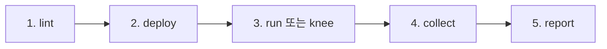

# jmeter Plugin

JMeter 스트레스 테스트 파이프라인 — JMX 정적 린트부터 원격 부하 실행, knee/MAX TPS 탐색, 결과 수집·무결성 검증, 보고서·차트 생성까지 GS 인증 스트레스 시나리오를 재현 가능한 형태로 수행하는 도메인 플러그인입니다.

> **부하 발사 원칙 (절대)**: 부하는 항상 원격 부하원(예: keco-train-01/02, master에서 `-R` workers 분산)에서만 발사한다. 로컬에서 JMeter로 부하를 발사하는 것은 금지 — 로컬 `jmeter` 바이너리는 `-g`(jtl→HTML 리포트) 후처리 전용이다.

## 파이프라인



## 🛠️ 포함 스킬 (7)

| 스킬 | 용도 | 사용 예 |
| :-- | :-- | :-- |
| **`lint`** | JMX 정적 분석 — 조기사망 위험, 무한루프, 파라미터 누락, 상대경로 에셋 | `/jmeter:lint src/jmeter/5-3.jmx` |
| **`deploy`** | 원격 설치·배포·기동 — JDK17+JMeter 5.6.3 idempotent 설치, rsync 증분 배포, jmeter-server 절대경로 CWD 기동 | `/jmeter:deploy — 부하원 두 대 세팅해줘` |
| **`run`** | 시나리오 1회 실행 — T 계산 x2/x1 분산 실행, 풀가동 집계, run.md/summary.md 누적 | `/jmeter:run 5-3.jmx vu=30 ramp=60 duration=120` |
| **`knee`** | 점진 VU 래더 — 판정표(이상/평탄/진행) 기반 knee·MAX TPS 탐색, 드레인 게이트 | `/jmeter:knee 5-3.jmx — MAX TPS 찾아줘` |
| **`collect`** | 결과 역수집·무결성 3종 — rsync 증분, 중단 run 판별, 로컬 HTML 리포트, `--evidence` 로그 보존 | `/jmeter:collect — 오늘 결과 받아서 검증해줘` |
| **`report`** | 결과서·차트 생성 — summary.md/run.md 기반 VU 추이, knee 판정, 병목 스켈레톤 | `/jmeter:report 5-3 — 결과서 만들어줘` |
| **`bottleneck`** | 부하 결과와 시스템 지표를 바탕으로 병목 계층 판별 | `/jmeter:bottleneck 5-3 — 병목을 분석해줘` |

## jmeter.json 최소 예제

프로젝트 루트에 둔다 (스키마 spec §3 — `metrics`/`verify_db`/`smoke`는 선택):

```json
{
  "master": "keco-train-01",
  "workers": [
    { "host": "keco-train-01", "ip": "10.0.0.11" },
    { "host": "keco-train-02", "ip": "10.0.0.12" }
  ],
  "remote_path": "/home/user/ecoai-gwageo",
  "ssh": { "user": "user", "port": 22, "key_ref": "~/.ssh/id_ed25519" },
  "remote_os": "linux"
}
```

## 요구사항

- 원격 부하원: Linux(`remote_os`), JDK 17, JMeter 5.6.3 (deploy가 미설치 노드에 자동 설치)
- 로컬 → 원격 ssh 접근 (`jmeter.json` ssh 필드)
- 프로젝트 자산: `src/jmeter/*.jmx` (lint 대상), 결과는 원격 `results/` → 로컬 역수집
- 차트 생성 시 로컬 Python 3 + matplotlib

## 🚀 설치 방법

```bash
claude plugin install jmeter@zzizily
```
