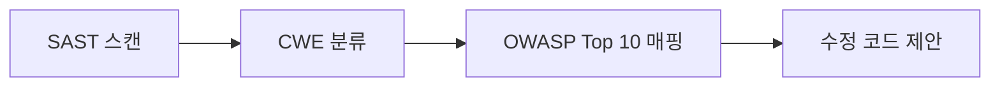

# Code Audit

코드 수준 보안 취약점 정적 분석.

## Usage

```text
/zzizily:code-audit           → 현재 프로젝트 스캔
/zzizily:code-audit <path>    → 특정 경로 스캔
```

## 핵심 프로세스

```text
SAST 스캔 → CWE 분류 → OWASP Top 10 매핑 → 수정 코드 제안
```



## Workflow

### 1. 대상 감지

```bash
# 기본: 현재 디렉토리
TARGET="${args[0]:-.}"

# 언어/프레임워크 감지
ls "$TARGET"/{package.json,pom.xml,build.gradle,requirements.txt,pyproject.toml,Cargo.toml,go.mod,Gemfile,*.csproj,*.sln} 2>/dev/null
```

| 감지 파일 | 언어 | SAST 도구 |
| :--- | :--- | :--- |
| `package.json` | JavaScript/TypeScript | `semgrep` |
| `pom.xml` / `build.gradle` | Java | `semgrep` |
| `requirements.txt` / `pyproject.toml` | Python | `semgrep`, `bandit` |
| `Cargo.toml` | Rust | `semgrep` |
| `go.mod` | Go | `semgrep`, `gosec` |
| `Gemfile` | Ruby | `semgrep`, `brakeman` |
| `*.csproj` / `*.sln` | C# | `semgrep` |

### 2. 스캔 대상 필터링

의존성 디렉토리, 빌드 산출물은 제외해야 false positive 방지.

```bash
# 공통 제외 패턴
EXCLUDE="--exclude node_modules --exclude .git --exclude venv --exclude __pycache__ \
  --exclude dist --exclude build --exclude .next --exclude vendor --exclude target"
```

### 3. SAST 스캔

#### Semgrep (공통, 멀티언어)

```bash
# 안전한 임시 파일 (프로세스별 고유)
RESULT_FILE=$(mktemp /tmp/semgrep-XXXXXX.json)

# auto 룰로 스캔 (OWASP Top 10 + security 포함)
semgrep --config auto --json $EXCLUDE "$TARGET" > "$RESULT_FILE"

# 특정 룰셋 (필요시 — p/security는 Semgrep 공식 보안 룰)
semgrep --config p/owasp-top-ten --config p/security --config p/secrets $EXCLUDE "$TARGET"
```

> `p/security`는 Semgrep 공식 보안 룰셋. `p/security-audit`는 낮은 신뢰도 룰이 포함될 수 있으므로 제외.

#### 언어별 추가 도구

```bash
# Python — bandit
bandit -r -f json -x "./node_modules,./venv,./.git" "$TARGET" > "$(mktemp /tmp/bandit-XXXXXX.json)" 2>/dev/null

# Go — gosec (./... 로 재귀 스캔)
gosec -fmt=json -out="$(mktemp /tmp/gosec-XXXXXX.json)" ./...  2>/dev/null

# Ruby (Rails) — brakeman
brakeman -f json "$TARGET" > "$(mktemp /tmp/brakeman-XXXXXX.json)" 2>/dev/null

# JavaScript/TypeScript — eslint-plugin-security (플러그인 설치 필요)
# 사전 확인: npx eslint --print-config "$TARGET/index.js" | grep eslint-plugin-security
npx eslint --rule 'security/*' --format json $EXCLUDE "$TARGET" > "$(mktemp /tmp/eslint-XXXXXX.json)" 2>/dev/null
```

> 설치되지 않은 도구는 스킵. semgrep이 기본, 나머지는 보조.
> `mktemp /tmp/name-XXXXXX`로 프로세스별 고유 파일명 생성 (병렬 스캔 안전).

### 4. CWE 분류

SAST 결과의 각 이슈를 CWE(Common Weakness Enumeration)로 매핑.

| 대표 CWE | 이름 | 빈도 |
| :--- | :--- | :--- |
| CWE-79 | XSS (Cross-site Scripting) | 높음 |
| CWE-89 | SQL Injection | 높음 |
| CWE-22 | Path Traversal | 중간 |
| CWE-78 | OS Command Injection | 높음 |
| CWE-200 | Information Exposure | 중간 |
| CWE-352 | CSRF | 중간 |
| CWE-611 | XXE | 중간 |
| CWE-798 | Hardcoded Credentials | 높음 |
| CWE-502 | Deserialization | 높음 |
| CWE-918 | SSRF | 중간 |
| CWE-287 | Authentication Failure | 높음 |
| CWE-327 | Weak Crypto | 중간 |
| CWE-732 | Incorrect Permission Assignment | 중간 |

### 5. OWASP Top 10 매핑

각 CWE를 OWASP Top 10 (2021) 카테고리로 분류. (공식 OWASP 매핑 기준)

| OWASP Top 10 (2021) | ID | 대표 CWE |
| :--- | :--- | :--- |
| Broken Access Control | A01 | CWE-22, CWE-200, CWE-352, CWE-732 |
| Cryptographic Failures | A02 | CWE-327, CWE-328 |
| Injection | A03 | CWE-78, CWE-79, CWE-89 |
| Insecure Design | A04 | CWE-209 |
| Security Misconfiguration | A05 | CWE-16, CWE-611 |
| Vulnerable Components | A06 | (→ system-audit) |
| Auth Failures | A07 | CWE-287, CWE-798 |
| Software/Data Integrity | A08 | CWE-502 |
| Logging Failures | A09 | CWE-117, CWE-532, CWE-778 |
| SSRF | A10 | CWE-918 |

> **OWASP 카테고리 ≠ 심각도**: 같은 카테고리 내에서도 개별 취약점의 심각도는 다름.
> 심각도는 SAST 도구 자체 판정(severity 필드)을 우선 사용.

### 6. 결과 리포트

```text
## Code Audit 결과

대상: [프로젝트명] ([언어])
도구: semgrep, bandit
스캔 파일: 142개

🔴 [OWASP A03] SQL Injection
━━━━━━━━━━━━━━━━
📋 CWE-89: SQL Injection
📌 위치: src/api/user.go:42
📝 설명: 사용자 입력이 SQL 쿼리에 직접 삽입
🔧 수정: Parameterized Query 사용
  - Before: db.Query("SELECT * FROM users WHERE id = " + input)
  + After:  db.Query("SELECT * FROM users WHERE id = $1", input)
━━━━━━━━━━━━━━━━

🟠 [OWASP A07] Hardcoded Credentials
📋 CWE-798: Use of Hard-coded Credentials
📌 위치: config/database.py:15
🔧 수정: 환경변수 또는 Secret Manager 사용

---

## 요약

| OWASP | Critical | High | Medium | Low |
| :--- | :--- | :--- | :--- | :--- |
| A03 Injection | 1 | 2 | - | - |
| A07 Auth | - | 1 | 1 | - |
| A02 Crypto | - | - | 1 | - |
```

### 7. 후속 안내

- **수정 적용**: 제안된 수정 코드를 검토 후 반영
- **재스캔**: 수정 후 `/zzizily:code-audit` 재실행하여 회귀 확인
- **패키지 취약점**: `/zzizily:system-audit`으로 의존성 CVE 확인

## Key Rules

- **기본 대상**: `.` (현재 프로젝트), 경로 지정 시 해당 경로
- **의존성/빌드 산출물 제외**: node_modules, venv, .git, dist, build 등
- **semgrep 우선**: 멀티언어 지원, 설치 안 되어 있으면 안내 후 스킵
- **언어별 도구는 보조**: bandit, gosec, brakeman 등은 선택적
- **False positive 최소화**: 높은 신뢰도 rule만 사용 (`p/security`), 의심 시 확인 표시
- **심각도는 도구 판정 사용**: OWASP 카테고리로 고정하지 않음
- **수정 코드 제안**: 문제만 지적하지 않고 실제 수정 코드를 함께 제시
- **A06(Vulnerable Components)은 제외**: 의존성 취약점은 `/zzizily:system-audit` 영역
- **한국어 리포트**: 결과는 항상 한국어로 출력
