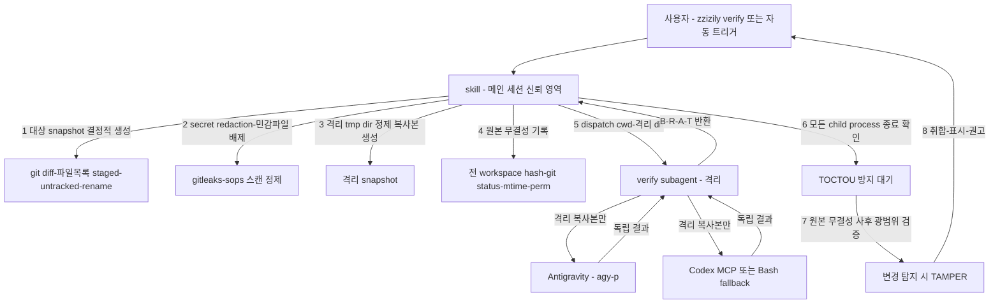

# Verify

spec/plan·코드를 Codex+Antigravity 2-Way로 교차검증. **skill은 신뢰 영역(진입점 + 보안 책임 + 판사)**, **subagent는 격리 영역(순수 검증)**. 검증 대상의 prompt injection으로 subagent가 조종될 수 있다는 전제로, 보안 결정권은 skill만 보유.

## Usage

```text
/zzizily:verify                          → 현재 git diff (staged/unstaged) 검증
/zzizily:verify <path>                   → 지정 파일/디렉토리 검증
/zzizily:verify docs/specs/xxx.md        → spec/plan 문서 검증 (항상 2-Way)
```

자동 트리거: 사용자 명시적 입력에서 "검증", "verify", "리뷰해줘" + 검증 대상 감지 시 호출.

**제외 필터 (무한 루프 방지)**: 아래 상태에서는 자동 트리거 금지.

- 이미 `/zzizily:verify` 실행 중
- 직전 Verification Report 출력 중
- 세션 opt-out 플래그 활성
- 자기 자신의 검증 결과를 다시 "검증" 대상으로 감지

## 아키텍처 (v3)



| 컴포넌트 | 역할 | 위치 |
| :--- | :--- | :--- |
| **skill** `verify` | 진입점 + **보안 책임**(snapshot/redaction/무결성 감시) + 판사(취합) | `skills/verify/SKILL.md` |
| **subagent** `verify` | 격리 snapshot에서 **순수 2-Way 검증만**. 보안 결정권 없음. B/R/A/T 반환 | `.claude-plugin/agents/verify.md` |

## 외부 전송 동의

**최초 1회** 외부 provider(Antigravity/Codex) 전송 동의 필요.

| 방식 | 설명 |
| :--- | :--- |
| Project-level 사전 동의 | `.omc/` 또는 프로젝트 설정에 동의 기록 시 재확인 없이 진행 |
| 첫 호출 확인 | 미동의 상태에서 첫 호출 시 사용자에게 1회 확인. 동의 시 세션 내 재사용 |

**미동의 시**: 외부 provider 전송 금지 → 수동 검증 안내 후 종료. 검증 결과의 Integrity는 항상 `Consent: DENIED`로 표기.

## 보안 책임 (v3 핵심)

skill(메인 세션, 신뢰 영역)이 모든 보안 결정을 담당. dogfood 2라운드에서 확인된 핵심: subagent가 보안 검증을 자체 수행하면 검증 대상의 prompt injection에 조종되어 무력화됨.

### 1. 대상 snapshot 결정적 생성

```bash
# 검증 대상 파일 목록 (staged + unstaged + untracked + rename/delete/binary)
git diff --name-status HEAD                 # tracked 변경 (staged + unstaged)
git ls-files --others --exclude-standard    # untracked (신규)
git diff --find-renames --name-only         # rename 감지
git diff --diff-filter=D --name-only        # delete 감지
git diff --numstat                          # binary/대용량 감지 (-	- 형태)
```

| 케이스 | 처리 |
| :--- | :--- |
| staged + unstaged 혼합 | 양쪽 모두 포함 (작업 중인 전체 변경) |
| untracked 신규 파일 | `git add -N --intent-to-add` 후 diff에 포함 |
| rename | `--find-renames`로 감지,新旧 모두 스캔 |
| delete | 삭제된 파일의 마지막 커밋 내용을 diff에 포함 |
| binary | `--numstat`으로 `-` 표기 감지, text 취급 불가 → 별도 표기 |
| 대용량 (1MB+) | diff 잘림 방지를 파일 단위 전달 |

대상 외 파일(변경 없는 파일)은 snapshot에서 제외. 단, 무결성 기록은 **전 workspace** 대상 (아래 참조).

### 2. Secret redaction (fail-closed)

```bash
# gitleaks 스캔 (설치 확인)
command -v gitleaks || { echo "FAIL-CLOSED: gitleaks 미설치"; exit 1; }

# 검증 대상 파일 대상 secret 스캔
gitleaks detect --source "$TARGET" --no-banner --redact --report-format json --report-path "$(mktemp /tmp/gitleaks-XXXXXX.json)"

# sops 암호화 파일 감지 (이미 암호화된 secret은 추가 처리 불필요)
find "$TARGET" -name '*.sops' -o -name '.sops.yaml' 2>/dev/null

# 매칭 시 [REDACTED] 치환
# binary/base64/분할 secret/encrypted 패턴도 동일하게 스캔
```

| 조건 | 처리 |
| :--- | :--- |
| gitleaks 매칭 | 매칭 라인 `[REDACTED]` 치환 후 snapshot 포함 |
| sops 암호화 파일 | 이미 암호화되어 있으므로 그대로 포함 (평문 아님) |
| **scanner 실패/미설치** | **fail-closed**: 검증 중단. INCOMPLETE 리포트 |

### 3. 민감 파일 배제

snapshot 생성 시 아래 패턴은 원천 제외.

```bash
# 배제 패턴 (rsync --exclude 또는 find 필터)
EXCLUDE_PATTERNS=(
  '.env*'           # 환경변수 (평문 secret 가능)
  '*.key'           # 개인키
  '*.pem'           # 인증서/키
  '.sops'           # sops 메타데이터
  '.gitleaks.toml'  # gitleaks 설정 (allowlist로 secret 우회 가능)
  '.codex/'         # Codex config (API key 등)
  '.config/**'      # 사용자 config (토큰 가능)
  '.aws/'           # AWS credential
  '.ssh/'           # SSH 키
  '.gnupg/'         # GPG 키링
)
```

### 4. 격리 tmp directory 정제 복사본 생성

```bash
# 프로세스별 고유 격리 dir
ISOLATED_DIR=$(mktemp -d /tmp/verify-isolated-XXXXXX)

# 정제 복사본 생성 (배제 패턴 + redaction 적용된 파일만)
# 대상 snapshot 파일만 복사 (전 workspace 아님)
rsync -av --files-from <(echo "$TARGET_FILES") \
  --exclude '.env*' --exclude '*.key' --exclude '*.pem' \
  "$WORKSPACE/" "$ISOLATED_DIR/"

# 확인: 격리 dir에 .env, .key 등이 없어야 함
find "$ISOLATED_DIR" \( -name '.env*' -o -name '*.key' -o -name '*.pem' \) -print | grep -q . && {
  echo "FAIL-CLOSED: 격리 snapshot에 민감 파일 잔류"; exit 1; }
```

**원본 workspace 접근 차단**: subagent의 `cwd`를 격리 dir로 강제. 원본 workspace 경로는 subagent에 전달하지 않음.

### 5. 원본 무결성 기록 (검증 전)

**전 workspace** 상태를 기록. 대상 파일뿐 아니라 대상 외·metadata까지 사후 검증 범위.

```bash
# tracked 파일 hash
git ls-files | xargs shasum -a 256 > "$(mktemp /tmp/integrity-tracked-XXXXXX.txt)"

# untracked 파일 hash (무결성 감시 대상)
git ls-files --others --exclude-standard | xargs shasum -a 256 > "$(mktemp /tmp/integrity-untracked-XXXXXX.txt)"

# git status 스냅샷
git status --porcelain=v1 --branch > "$(mktemp /tmp/integrity-status-XXXXXX.txt)"

# 파일 metadata (mtime, permission)
find . -type f \( ! -path './.git/*' \) -exec stat -f '%m %Sp %N' {} \; > "$(mktemp /tmp/integrity-meta-XXXXXX.txt)"
```

## dispatch 실행 계약

```text
도구: Agent
subagent: verify (namespace zzizily:verify)
입력(자연어 지시에 포함):
  - isolated_cwd: 격리 tmp directory 절대경로
  - target_kind: spec-plan | code
  - target_files: 격리 복사본 내 상대경로 목록
  - tier: light | standard | high (코드만)
  - acceptance_criteria: 선택
  - provider_config: Codex model/sandbox, Antigravity 모델 (rules에서 읽어 전달)
반환: subagent 최종 메시지 = Verification Report
미발견 처리: discovery 실패 시 에러 리포트(plugin 미설치/agents 필드 누락/reload-plugins 의심) 출력 후 종료
```

### Agent 도구 호출 예시

```
Agent(
  subagent_type: "verify",
  description: "2-Way 교차검증 (격리 snapshot)",
  prompt: """
isolated_cwd: /tmp/verify-isolated-aB3xY
target_kind: spec-plan
target_files:
  - docs/specs/2026-07-15-feature.md
  - plans/implementation-plan.md
tier: (spec-plan은 무시)
acceptance_criteria: (선택) "모든 섹션이 구현 가능한 단위로 분할되어 있을 것"
provider_config:
  codex_model: gpt-5.6-sol
  codex_sandbox: read-only
  antigravity_model: Gemini 3.1 Pro (High)

격리 복사본으로 2-Way 검증 후 Verification Report 반환.
  """
)
```

### Discovery 실패 처리

subagent `verify`가 발견되지 않으면 에러 리포트 출력 후 종료 (검증 진행 안 함).

```text
[ERROR] verify subagent discovery 실패
확인 사항:
  1. plugin 설치 상태 (claude plugin list | grep zzizily)
  2. plugin.json "agents" 필드 존재 (".claude-plugin/agents/")
  3. /reload-plugins 실행 후 재시도
  4. .claude-plugin/agents/verify.md 존재 확인
```

## 무결성 사후 검증 (TOCTOU 방지)

subagent 반환 후, **모든 child process 종료를 확인한 뒤** 원본 무결성을 광범위하게 재측정·비교. timeout으로 잔존한 process가 검증 후 원본을 변경하는 TOCTOU(Time-of-Check-to-Time-of-Use) 공격 방지.

```bash
# 1. 모든 child process 종료 확인 (timeout 30s)
# agy, codex child process가 완전히 종료되었는지 확인
pgrep -f 'agy -p' || pgrep -f 'codex exec' && wait

# 2. 전 workspace 무결성 재측정 (검증 전과 동일 항목)
git ls-files | xargs shasum -a 256 > "$(mktemp /tmp/integrity-tracked-post-XXXXXX.txt)"
git ls-files --others --exclude-standard | xargs shasum -a 256 > "$(mktemp /tmp/integrity-untracked-post-XXXXXX.txt)"
git status --porcelain=v1 --branch > "$(mktemp /tmp/integrity-status-post-XXXXXX.txt)"
find . -type f \( ! -path './.git/*' \) -exec stat -f '%m %Sp %N' {} \; > "$(mktemp /tmp/integrity-meta-post-XXXXXX.txt)"

# 3. 비교 (tracked/untracked/metadata/대상 외/write→restore 모두)
diff "$INTEGRITY_TRACKED_PRE" "$INTEGRITY_TRACKED_POST"
diff "$INTEGRITY_UNTRACKED_PRE" "$INTEGRITY_UNTRACKED_POST"
diff "$INTEGRITY_STATUS_PRE" "$INTEGRITY_STATUS_POST"
diff "$INTEGRITY_META_PRE" "$INTEGRITY_META_POST"
```

| 결과 | 처리 |
| :--- | :--- |
| 차이 없음 | `Integrity: VERIFIED`. subagent 결과 신뢰 |
| **차이 감지** | `Integrity: TAMPER-DETECTED`. 검증 무효 → Verdict `INCOMPLETE` |
| tracked 파일 변경 | subagent가 원본 수정 시도 (격리 우회 시도) |
| untracked 파일 생성 | subagent가 workspace에 파일 생성 |
| 대상 외 파일 변경 | subagent가 검증 대상 외 파일 조작 (prompt injection 의심) |
| metadata/permission 변경 | 권한 상승 또는 mtime 조작 |
| write → restore | 내용은 동일하나 mtime 변경 (숨겨진 수정 시도) |

## 취합 · 표시

subagent의 Verification Report + skill의 Integrity 보고를 통합 표시.

```text
## Verification Result

### Verdict (subagent)
**Status**: PASS | FAIL | INCOMPLETE
**Target**: spec-plan | code
**Tier**: light | standard | high
**Routes used**: Antigravity(agy | failed), Codex(MCP | Bash-fallback | failed)

### Integrity (skill)
**Consent**: GRANTED | DENIED
**Redaction**: OK | FAIL-CLOSED(scanner 실패)
**Integrity**: VERIFIED | TAMPER-DETECTED

### Findings (subagent, 출처 표기)
- [Blocker] 즉시 수정 필요 — 근거(file:line/인용) — 출처: Codex | Antigravity | both
- [Risk] 수정 권장 — 근거 — 출처
- [Assumption] 검증된 가정 — 출처
- [Test] 제안 테스트 — 출처

### Cross-Check (2-Way 시)
| 항목 | Antigravity | Codex | 일치여부 | 충돌해결 |
| :--- | :--- | :--- | :--- | :--- |

### Recommendation
APPROVE | REQUEST_CHANGES | NEEDS_MORE_EVIDENCE
[한 줄 근거]
```

**blocker 존재 시**: 수정 권고 구체적으로 제시 (file:line 기준). **Integrity TAMPER 시**: 검증 결과 무효, 원인 조사 권고.

### 격리 tmp dir 정리

```bash
# 결과 표시 완료 후 격리 dir 정리 (민감 정보 잔류 방지)
rm -rf "$ISOLATED_DIR"
# 무결성 측정 파일도 정리
rm -f /tmp/integrity-*-*.txt /tmp/verify-isolated-* 2>/dev/null
```

## 데이터 흐름

1. 사용자 `/zzizily:verify [대상]` 또는 자동 트리거 (rules 최소 규칙 + 제외 필터)
2. **skill**: 외부 전송 동의 확인 (최초 1회). 미동의 시 수동 안내 종료
3. **skill**: 대상 snapshot 결정적 생성 (staged/unstaged/untracked/rename/delete/binary/대용량/혼합 우선순위)
4. **skill**: secret redaction + 민감 파일 배제 → 정제. scanner 실패 시 fail-closed
5. **skill**: 격리 tmp directory에 정제 복사본 생성
6. **skill**: 원본 무결성 기록 (전 workspace: tracked/untracked hash, git status, mtime, permission)
7. **skill**: `Agent` 도구로 verify subagent dispatch (격리 cwd + 복사본 + config)
8. **subagent**: 격리 복사본으로 2-Way 검증 (병렬 orchestration). B/R/A/T 반환
9. **skill**: 모든 child process 종료 확인 (TOCTOU 방지 대기)
10. **skill**: 원본 무결성 사후 광범위 검증. 변경 시 TAMPER-DETECTED → INCOMPLETE
11. **skill**: 결과 취합·표시. blocker 있으면 수정 권고. 격리 tmp dir 정리

## 라우팅 매핑

| 대상 | 조건 | 라우팅 | 종료 조건 |
| :--- | :--- | :--- | :--- |
| spec/plan | (항상) | Antigravity + Codex MCP **2-Way** | 양쪽 blocker 0, 충돌 해결 |
| 코드 | 경량 | Codex MCP 우선, 실패 시 `codex exec` **단일** | blocker 0 |
| 코드 | 표준 | Codex MCP 우선 단일 (승격 시 2-Way) | blocker 0, non-blocker 확인 |
| 코드 | 고위험 | Antigravity + Codex MCP **2-Way** | 양쪽 blocker 0, 충돌 해결 |

티어 판정: **고위험 승격조건 최우선** (인증/권한/비밀값/네트워크 경계 변경, 데이터 모델/마이그레이션, 배포 파이프라인, public API 호환성, 대규모 삭제/리팩토링 100줄+, 롤백 어려운 변경). 설정/minor도 보안·호환성 영향 시 고위험.

## Key Rules

- **보안 책임 skill 전담**: redaction, 민감 파일 배제, 무결성 감시는 skill(신뢰 영역)만 수행. subagent는 보안 결정권 없음 (검증 대상 prompt injection 조종 가능성 전제)
- **격리 snapshot 필수**: subagent `cwd`=격리 tmp directory. 원본 workspace·`.env`·Codex config 접근 차단. 정제 복사본만 전달
- **secret redaction fail-closed**: gitleaks/sops scanner 실패 또는 미설치 시 검증 중단 (INCOMPLETE). 매칭 시 `[REDACTED]` 치환
- **민감 파일 원천 배제**: `.env*`, `*.key`, `*.pem`, `.sops`, `~/.codex/`, `~/.config/**` 등은 snapshot에서 제외
- **무결성 전 workspace 감시**: 검증 전후로 tracked/untracked/hash/git status/mtime/permission 전 항목 비교. 대상 외 변경도 TAMPER
- **TOCTOU 방지**: 모든 child process 종료 확인 후 무결성 사후 검증. timeout 잔존 process의 사후 쓰기 차단
- **Codex workspace-write 금지**: 모든 Codex 경로 `--sandbox read-only`, `cwd`=격리 dir. MCP-first, 실패 시 `codex exec` fallback (workspace-write 절대 금지)
- **fail-closed 판정**: APPROVE는 (양쪽 또는 단일 성공) + blocker 0 + Integrity VERIFIED + Consent OK. timeout/빈 응답/양쪽 실패/무결성 변경 → INCOMPLETE (CI/merge에서 FAIL 동급 차단)
- **spec/plan 항상 2-Way**: 티어 무관 항상 Antigravity + Codex 2-Way (메인 검증)
- **외부 전송 동의 최초 1회**: 미동의 시 수동 검증 안내. 동의는 세션 또는 project-level
- **무한 루프 방지**: 자기 출력/실행 중 재트리거 금지 (제외 필터). rules 트리거는 최소 규칙만 잔류
- **격리 dir 정리**: 결과 표시 후 격리 tmp directory 및 무결성 측정 파일 삭제 (민감 정보 잔류 방지)
- **한국어 리포트**: 결과는 항상 한국어로 출력. finding은 provider 출처(Codex | Antigravity | both) 표기
